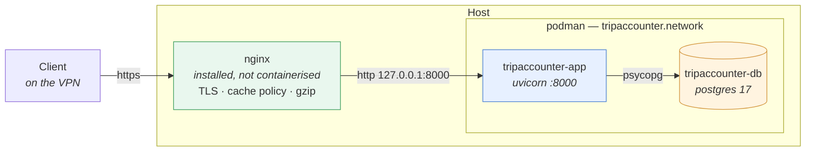

# Deploying Trip Accounter

One host. Two containers under systemd via Podman Quadlet, and nginx installed on
the host in front of them. The VPN is the perimeter — there is no authentication
anywhere in this application, so what nginx listens on is a security boundary, not a
preference.

`deploy/` holds the unit files this document installs.

---

## 1. The shape



**Why nginx is not a quadlet.** It terminates TLS, so it owns the certificates and
the renewal timer, both of which are host state that outlives any container. It is
also the only thing that must be listening before the app is up and must keep
listening while the app restarts. Putting it in the same lifecycle as the thing it
fronts buys nothing and costs a startup ordering problem.

**What each layer owns.** The app owns the *version* in a static asset's URL,
because only it knows the build id. nginx owns the *cache policy*, TLS, and
compression, because that is edge policy. Neither can do the other's half.

## 2. Prerequisites

```bash
dnf install -y podman nginx        # or the equivalent
```

Podman ≥ 4.4 for Quadlet. The units below are system services (root); §9 covers
rootless.

## 3. Build the image

```bash
podman build -t localhost/tripaccounter:latest \
             --build-arg BUILD_ID=$(git rev-parse --short HEAD) \
             -f Dockerfile .
```

`BUILD_ID` becomes `TA_BUILD_ID` in the image and is what mounts the static assets
under `/s/<build-id>/`, so nginx can cache them forever without ever serving a stale
one. Any string unique per build works — the git sha is just the one you already
have. Omit it and the app serves static files unversioned at `/`, which is correct
but uncacheable.

The `.container` unit references the **tag**, not the build, so this command is also
step 1 of every upgrade (§8).

## 4. Secrets

```bash
install -d -m700 /etc/tripaccounter
install -m600 deploy/postgres.env.example /etc/tripaccounter/postgres.env
install -m600 deploy/app.env.example      /etc/tripaccounter/app.env
```

Edit both. Pick a real `POSTGRES_PASSWORD` in `postgres.env` and mirror it into the
`TA_DATABASE_URL` password in `app.env`. These two files are the only place a
credential exists; they are `0600`, outside the repo, and gitignored under their
non-`.example` names.

## 5. Install the units

```bash
install -m644 deploy/tripaccounter.network deploy/postgres.volume \
              deploy/postgres.container deploy/tripaccounter.container \
              /etc/containers/systemd/
systemctl daemon-reload
systemctl enable --now postgres.service tripaccounter.service
```

Quadlet generates `tripaccounter-network.service` and `postgres-volume.service` from
the `Network=`/`Volume=` references, and starting the two container services pulls
them in. `tripaccounter.container` declares `Requires=postgres.service`, so ordering
is handled. Migrations run on every start — the image's `CMD` is `make migrate
start_server`.

`tripaccounter.container` publishes **`127.0.0.1:8000:8000`**. That is load-bearing:

> **Security.** The application has no authentication of any kind. Publishing port
> 8000 on all interfaces would expose the full API, unauthenticated, to every
> network the host is attached to. It must be reachable only through nginx, which is
> in turn reachable only from the VPN. The app is additionally started with
> `--forwarded-allow-ips '*'`, meaning it trusts `X-Forwarded-*` from whatever
> connects to it — safe when only a loopback proxy can connect, and not safe
> otherwise.

## 6. nginx

### 6.1 The site

`/etc/nginx/conf.d/tripaccounter.conf`:

```nginx
proxy_cache_path /var/cache/nginx/tripaccounter levels=1:2
                 keys_zone=tripaccounter:10m max_size=256m inactive=365d;

upstream tripaccounter {
    server 127.0.0.1:8000;
    keepalive 16;
}

server {
    listen 443 ssl;
    http2 on;
    server_name trips.example.internal;

    ssl_certificate     /etc/pki/tripaccounter/fullchain.pem;
    ssl_certificate_key /etc/pki/tripaccounter/privkey.pem;
    ssl_protocols       TLSv1.2 TLSv1.3;

    # 208 KB of ES modules, uncompressed at the source. This is the single
    # biggest win on a cold load and the app does not do it.
    gzip             on;
    gzip_vary        on;
    gzip_min_length  1024;
    gzip_types       text/css application/javascript application/json image/svg+xml;

    # Versioned static assets: the build id in the path is the cache key.
    location ~ ^/s/[^/]+/ {
        proxy_pass http://tripaccounter;
        proxy_http_version 1.1;
        proxy_set_header Connection "";

        add_header Cache-Control "public, max-age=31536000, immutable" always;

        proxy_cache        tripaccounter;
        proxy_cache_valid  200 365d;
        add_header X-Cache-Status $upstream_cache_status;
    }

    # index.html, /t/{slug}, /api/v1 — revalidated, never cached here.
    location / {
        proxy_pass http://tripaccounter;
        proxy_http_version 1.1;
        proxy_set_header Connection "";
        proxy_set_header Host              $host;
        proxy_set_header X-Real-IP         $remote_addr;
        proxy_set_header X-Forwarded-For   $proxy_add_x_forwarded_for;
        proxy_set_header X-Forwarded-Proto $scheme;
    }
}

server {
    listen 80;
    server_name trips.example.internal;
    return 301 https://$host$request_uri;
}
```

```bash
nginx -t && systemctl enable --now nginx
```

### 6.2 Why the cache block looks like that

- **The `location` regex is the entire safety mechanism.** `immutable` attaches to
  the versioned prefix and to nothing else, so `index.html` — matched by `location /`
  — can never acquire it. `index.html` is the manifest: it names the current build
  id, and a browser that cached it forever could never learn about a new one.
- **`[^/]+`, not `[0-9a-f]+`.** A build id may be an image tag or a release name, not
  only a git sha.
- **`always`** puts the header on a `304` as well as a `200`. Starlette answers
  `If-None-Match` from under the prefix; a revalidation that gets through should
  refresh the freshness lifetime rather than leave the stored response without one.
- **No `proxy_hide_header`.** The app sends no `Cache-Control` on static files, so
  there is nothing to suppress and `add_header` cannot produce a duplicate. It does
  send `no-cache` on `index.html` and on `/api/v1`, which is why neither location
  adds a header of its own.
- **`proxy_cache` is the optional half.** It spares uvicorn from cold clients — first
  visit, cleared cache, fresh deploy. Drop it and browser caching still works
  completely; the `add_header` line is the part that matters.
- **`/api/v1` is never proxy-cached.** It carries `Cache-Control: no-cache` and an
  `ETag` computed per response (`ETagMiddleware`), which is revalidation, not
  caching. `location /` adds nothing and passes it through.

### 6.3 Certificates

The host is VPN-only, so there is nothing for an HTTP-01 challenge to reach. Two
workable routes:

| Route | When |
|---|---|
| **Let's Encrypt over DNS-01** — `certbot certonly --dns-<provider> -d trips.example.internal` | The name lives in a DNS zone you control. Real chain, automatic renewal, no inbound exposure. |
| **Internal CA** — your own root, distributed to the devices on the VPN | No public DNS at all. You own the renewal calendar. |

Point `ssl_certificate`/`ssl_certificate_key` at whichever you picked. With certbot,
add a deploy hook so nginx reloads on renewal:

```bash
echo 'systemctl reload nginx' > /etc/letsencrypt/renewal-hooks/deploy/nginx.sh
chmod +x /etc/letsencrypt/renewal-hooks/deploy/nginx.sh
```

## 7. Verify

```bash
systemctl status postgres.service tripaccounter.service nginx
curl -sS http://127.0.0.1:8000/api/v1/trips            # app, direct
curl -sS https://trips.example.internal/api/v1/trips   # through nginx

# the asset URL the page actually references, and its headers
curl -sI https://trips.example.internal/ | grep -i cache-control        # expect: no-cache
curl -s  https://trips.example.internal/ | grep -o '/s/[^"]*app.js'
curl -sI https://trips.example.internal/s/<build-id>/js/app.js | grep -i 'cache-control\|x-cache'
```

The last one must say `public, max-age=31536000, immutable`. The first must not.

From outside the VPN, `curl https://trips.example.internal/` must not connect at all
— if it does, the perimeter is not where you think it is.

## 8. Upgrading

```bash
podman build -t localhost/tripaccounter:latest \
             --build-arg BUILD_ID=$(git rev-parse --short HEAD) \
             -f Dockerfile .
systemctl restart tripaccounter.service
```

Migrations run on start. The new build id changes every static asset's URL, so every
client picks up the new frontend on its next load of `index.html` — which is
revalidated every time, by construction. There is no cache to purge, in the browser
or in nginx: the old URLs are simply never requested again.

**Rollback** is the same command against the previous commit. The old build id
returns, and any client that still holds those assets in cache is correct rather
than stale.

Postgres data lives in the `postgres.volume` quadlet volume and survives image
rebuilds, container replacement and restarts. Only `podman volume rm
systemd-postgres` destroys it.

## 9. Backups

```bash
podman exec tripaccounter-db pg_dump -U tripaccounter tripaccounter \
  | gzip > /var/backups/tripaccounter-$(date +%F).sql.gz
```

Restore into a running, empty database:

```bash
gunzip -c /var/backups/tripaccounter-2026-01-31.sql.gz \
  | podman exec -i tripaccounter-db psql -U tripaccounter tripaccounter
```

A `systemd` timer around the first command is the whole backup strategy this
application needs; the volume alone is not a backup.

## 10. Rootless

The same unit files work as user services:

- install them to `~/.config/containers/systemd/` instead of
  `/etc/containers/systemd/`
- keep the env files somewhere your user owns, `0600`, and update
  `EnvironmentFile=` in both `.container` units to match
- `systemctl --user` throughout, plus `loginctl enable-linger $USER` so the
  containers start at boot rather than at login

nginx stays a root-owned host service — it binds 443 — and still proxies to
`127.0.0.1:8000`. Nothing in the nginx config changes.

## 11. Troubleshooting

| Symptom | Where to look |
|---|---|
| `502 Bad Gateway` | `systemctl status tripaccounter.service`; the container is down or still running migrations. `podman logs tripaccounter-app`. |
| App up, DB errors on start | Password in `app.env`'s `TA_DATABASE_URL` does not match `postgres.env`. Both files, one value. |
| `tripaccounter.service` restart-loops | `podman logs tripaccounter-app` — an alembic failure surfaces here, before uvicorn ever binds. |
| Frontend serves an old build after a deploy | `curl -s https://host/ \| grep -o '/s/[^"]*app.js'` — if the build id is current, the browser is holding `index.html` itself, which means something overrode its `Cache-Control: no-cache` in `location /`. |
| `X-Cache-Status: MISS` on every request | `proxy_cache_path` missing from the http context, or `/var/cache/nginx/tripaccounter` not writable by nginx. |
| Assets have no `Cache-Control` | The image was built without `BUILD_ID`, so the assets are at `/js/...` and never match the `/s/` location. |
