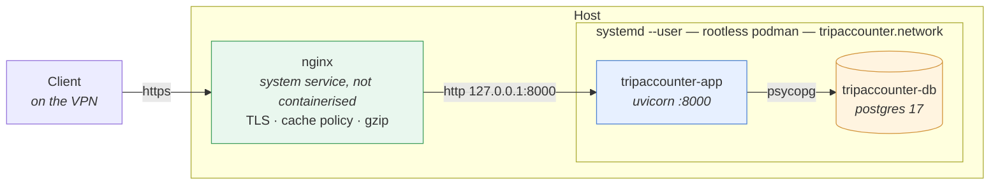

# Deploying Trip Accounter

One host. Two containers running as **user services** — rootless Podman Quadlet
under the systemd user manager of the account that owns the deployment — and nginx
installed on the host in front of them. The VPN is the perimeter — there is no
authentication anywhere in this application, so what nginx listens on is a security
boundary, not a preference.

`deploy/` holds the unit files this document installs.

---

## 1. The shape


```mermaid
flowchart LR
    vpn["Client<br/><i>on the VPN</i>"]

    subgraph hostbox["Host"]
        nginx["nginx<br/><i>system service, not containerised</i><br/>TLS · cache policy · gzip"]
        subgraph user["systemd --user — rootless podman — tripaccounter.network"]
            app["tripaccounter-app<br/><i>uvicorn :8000</i>"]
            db[("tripaccounter-db<br/><i>postgres 17</i>")]
        end
    end

    vpn -- "https" --> nginx
    nginx -- "http 127.0.0.1:8000" --> app
    app -- "psycopg" --> db

    style nginx fill:#e9f7ee,stroke:#3f9e5f
    style app fill:#e7f0ff,stroke:#4a7fd4
    style db fill:#fff4e0,stroke:#d2933a
```

**Why user services.** Nothing the app does needs root: it listens on an
unprivileged port, and its only state is a volume in the user's own container
storage. Run as a user, a container escape lands in an unprivileged account whose
container root maps to a subuid rather than to host root, and every file the
deployment owns — units, secrets, images, data — lives under one home directory.
There is no system-wide install of any of it.

**Why nginx is not a quadlet.** It terminates TLS, so it owns the certificates and
the renewal timer, both of which are host state that outlives any container. It is
also the only thing that must be listening before the app is up and must keep
listening while the app restarts. Putting it in the same lifecycle as the thing it
fronts buys nothing and costs a startup ordering problem. It is the one piece outside
this user's services — it binds 443.

**What each layer owns.** The app owns the *version* in a static asset's URL,
because only it knows the build id. nginx owns the *cache policy*, TLS, and
compression, because that is edge policy. Neither can do the other's half.

## 2. Prerequisites

Pick the account the app runs as — your own, or a dedicated one — and log in as it
directly, over SSH or at a console. Everything from §3 on runs as that user, in its
home directory, with `systemctl --user`. The host needs Podman ≥ 5.0 (Quadlet itself
needs 4.4, `Notify=healthy` needs 5.0) and an nginx configured as in §6.

```bash
sudo loginctl enable-linger "$USER"     # the one root step: user manager starts at boot
grep "^$USER:" /etc/subuid /etc/subgid  # both must list a range
```

Without lingering, the user manager — and with it both containers — starts only when
the user logs in and stops when they log out. Without a subuid/subgid range, rootless
podman cannot unpack an image; `useradd` assigns one to every regular account, so it
is only missing on accounts created some other way.

## 3. The image

Every push to `main` publishes `ghcr.io/pehala/tripaccounter` (`.github/workflows/docker.yml`)
as `latest`, the only tag it ever gets. The package is public, so the host pulls it
with no registry login, and `tripaccounter.container` tracks that tag.

CI builds with `BUILD_ID` set to the commit sha. It becomes `TA_BUILD_ID` in the
image and is what mounts the static assets under `/s/<build-id>/`, so nginx can cache
them forever without ever serving a stale one. An image built without it serves
static files unversioned at `/`, which is correct but uncacheable.

To run a local build instead, build it as the deploying user — rootless images live
in that user's storage — and point `Image=` at it (dropping `AutoUpdate=`, which only
works against a registry):

```bash
podman build -t localhost/tripaccounter:latest \
             --build-arg BUILD_ID=$(git rev-parse --short HEAD) \
             -f Dockerfile .
```

## 4. Secrets

```bash
install -d -m700 ~/.config/tripaccounter
install -m600 deploy/postgres.env.example ~/.config/tripaccounter/postgres.env
install -m600 deploy/app.env.example      ~/.config/tripaccounter/app.env
```

Edit both. Pick a real `POSTGRES_PASSWORD` in `postgres.env` and mirror it into the
`TA_DATABASE_URL` password in `app.env`. These two files are the only place a
credential exists; they are `0600`, outside the repo, and gitignored under their
non-`.example` names. The units read them as `%h/.config/tripaccounter/*.env`;
systemd expands `%h` to the home of the user running them.

## 5. Install the units

```bash
install -d ~/.config/containers/systemd
install -m644 deploy/tripaccounter.network deploy/postgres.volume \
              deploy/postgres.container deploy/tripaccounter.container \
              ~/.config/containers/systemd/
systemctl --user daemon-reload
systemctl --user start postgres.service tripaccounter.service
systemctl --user enable --now podman-auto-update.timer
```

Quadlet units are not `systemctl --user enable`d: the `[Install]` section
(`WantedBy=default.target`) is applied by the generator on `daemon-reload`, and with
lingering on, the user manager — and both services — start at boot.

Quadlet generates `tripaccounter-network.service` and `postgres-volume.service` from
the `Network=`/`Volume=` references, and starting the two container services pulls
them in. `tripaccounter.container` declares `Requires=postgres.service`, and both
units set `Notify=healthy`: a service counts as started only once its healthcheck
passes, so the app does not start until Postgres answers `pg_isready`. The first
start pulls both images, which is what `TimeoutStartSec=900` is for. Migrations run
on every start — the image's `CMD` is `make migrate start_server`.

`tripaccounter.container` publishes **`127.0.0.1:8000:8000`**. That is load-bearing:

> **Security.** The application has no authentication of any kind. Publishing port
> 8000 on all interfaces would expose the full API, unauthenticated, to every
> network the host is attached to. It must be reachable only through nginx, which is
> in turn reachable only from the VPN. The app is additionally started with
> `--forwarded-allow-ips '*'`, meaning it trusts `X-Forwarded-*` from whatever
> connects to it — safe when only a loopback proxy can connect, and not safe
> otherwise.

The private `tripaccounter.network` does not make this redundant. It is a bridge that
only the containers are on, inside the user's network namespace; nginx runs on the
host, so the only way it can reach the app is a published port, and the address in
`PublishPort=` decides who else can. Rootless, that port is an ordinary socket the
user's podman opens on the host. A bare `8000:8000` binds it on every interface —
the VPN one included, so any VPN client could skip nginx, talk plain HTTP to the app
and set its own `X-Forwarded-*` — and the host firewall would be the only thing left
in the way.

## 6. nginx

### 6.1 The site

`/etc/nginx/conf.d/tripaccounter.conf`:

```nginx
proxy_cache_path /var/cache/nginx/tripaccounter levels=1:2
                 keys_zone=tripaccounter:10m max_size=256m inactive=365d;

upstream tripaccounter {
    server 127.0.0.1:8000;
    keepalive 16;
}

server {
    listen 443 ssl;
    http2 on;
    server_name trips.example.internal;

    ssl_certificate     /etc/pki/tripaccounter/fullchain.pem;
    ssl_certificate_key /etc/pki/tripaccounter/privkey.pem;
    ssl_protocols       TLSv1.2 TLSv1.3;

    # 208 KB of ES modules, uncompressed at the source. This is the single
    # biggest win on a cold load and the app does not do it.
    gzip             on;
    gzip_vary        on;
    gzip_min_length  1024;
    gzip_types       text/css application/javascript application/json image/svg+xml;

    # Versioned static assets: the build id in the path is the cache key.
    location ~ ^/s/[^/]+/ {
        proxy_pass http://tripaccounter;
        proxy_http_version 1.1;
        proxy_set_header Connection "";

        add_header Cache-Control "public, max-age=31536000, immutable" always;

        proxy_cache        tripaccounter;
        proxy_cache_valid  200 365d;
        add_header X-Cache-Status $upstream_cache_status;
    }

    # index.html, /t/{slug}, /api/v1 — revalidated, never cached here.
    location / {
        proxy_pass http://tripaccounter;
        proxy_http_version 1.1;
        proxy_set_header Connection "";
        proxy_set_header Host              $host;
        proxy_set_header X-Real-IP         $remote_addr;
        proxy_set_header X-Forwarded-For   $proxy_add_x_forwarded_for;
        proxy_set_header X-Forwarded-Proto $scheme;
    }
}

server {
    listen 80;
    server_name trips.example.internal;
    return 301 https://$host$request_uri;
}
```

### 6.2 Why the cache block looks like that

- **The `location` regex is the entire safety mechanism.** `immutable` attaches to
  the versioned prefix and to nothing else, so `index.html` — matched by `location /`
  — can never acquire it. `index.html` is the manifest: it names the current build
  id, and a browser that cached it forever could never learn about a new one.
- **`[^/]+`, not `[0-9a-f]+`.** A build id may be an image tag or a release name, not
  only a git sha.
- **`always`** puts the header on a `304` as well as a `200`. Starlette answers
  `If-None-Match` from under the prefix; a revalidation that gets through should
  refresh the freshness lifetime rather than leave the stored response without one.
- **No `proxy_hide_header`.** The app sends no `Cache-Control` on static files, so
  there is nothing to suppress and `add_header` cannot produce a duplicate. It does
  send `no-cache` on `index.html` and on `/api/v1`, which is why neither location
  adds a header of its own.
- **`proxy_cache` is the optional half.** It spares uvicorn from cold clients — first
  visit, cleared cache, fresh deploy. Drop it and browser caching still works
  completely; the `add_header` line is the part that matters.
- **`/api/v1` is never proxy-cached.** It carries `Cache-Control: no-cache` and an
  `ETag` computed per response (`ETagMiddleware`), which is revalidation, not
  caching. `location /` adds nothing and passes it through.

### 6.3 Certificates

The host is VPN-only, so there is nothing for an HTTP-01 challenge to reach. Two
workable routes:

| Route | When |
|---|---|
| **Let's Encrypt over DNS-01** — `certbot certonly --dns-<provider> -d trips.example.internal` | The name lives in a DNS zone you control. Real chain, automatic renewal, no inbound exposure. |
| **Internal CA** — your own root, distributed to the devices on the VPN | No public DNS at all. You own the renewal calendar. |

Point `ssl_certificate`/`ssl_certificate_key` at whichever you picked, and have
renewal reload nginx.

## 7. Verify

```bash
systemctl --user status postgres.service tripaccounter.service
curl -sS http://127.0.0.1:8000/api/v1/trips            # app, direct
curl -sS https://trips.example.internal/api/v1/trips   # through nginx

# the asset URL the page actually references, and its headers
curl -sI https://trips.example.internal/ | grep -i cache-control        # expect: no-cache
curl -s  https://trips.example.internal/ | grep -o '/s/[^"]*app.js'
curl -sI https://trips.example.internal/s/<build-id>/js/app.js | grep -i 'cache-control\|x-cache'
```

The last one must say `public, max-age=31536000, immutable`. The first must not.

From outside the VPN, `curl https://trips.example.internal/` must not connect at all
— if it does, the perimeter is not where you think it is.

## 8. Upgrading

Both containers carry `AutoUpdate=registry`. The user's `podman-auto-update.timer`
(daily, enabled in §5) compares each running image's digest with the registry's for
the same tag, pulls the ones that changed, and restarts their services. A merge to
`main` therefore reaches the host within a day; to take it now, or to see what would
change:

```bash
podman auto-update --dry-run    # which units have a newer image
podman auto-update              # pull and restart them now
```

If a restarted service fails to start — which, with `Notify=healthy`, includes the
healthcheck never passing — `podman auto-update` rolls it back to the previous image
and restarts it on that.

Postgres tracks `17-alpine`, so auto-update applies only 17.x minor releases, which
share the on-disk format. A major upgrade is a `pg_dump` (§9), a new tag and a restore,
never a tag bump alone.

Migrations run on start. The new build id changes every static asset's URL, so every
client picks up the new frontend on its next load of `index.html` — which is
revalidated every time, by construction. There is no cache to purge, in the browser
or in nginx: the old URLs are simply never requested again.

**Rollback.** The registry holds only `latest`, so there is no older tag to pull. A
failed start rolls itself back (above). To go back from a build that starts fine but
is wrong, build the previous commit locally as in §3, point `Image=` in
`~/.config/containers/systemd/tripaccounter.container` at
`localhost/tripaccounter:latest` and drop `AutoUpdate=`, then:

```bash
systemctl --user daemon-reload
systemctl --user restart tripaccounter.service
```

Restore both lines once the fix is on `main`. The old build id returns, and any
client that still holds those assets in cache is correct rather than stale.
Migrations only go forward: a rollback across a migration needs the older image to
tolerate the newer schema, or a restore.

Postgres data lives in the `postgres.volume` quadlet volume, in the user's container
storage under `~/.local/share/containers/`. It survives image updates, container
replacement and restarts. Only `podman volume rm systemd-postgres` destroys it — or
removing the user's home.

## 9. Backups

```bash
mkdir -p ~/backups
podman exec tripaccounter-db pg_dump -U tripaccounter tripaccounter \
  | gzip > ~/backups/tripaccounter-$(date +%F).sql.gz
```

Restore into a running, empty database:

```bash
gunzip -c ~/backups/tripaccounter-2026-01-31.sql.gz \
  | podman exec -i tripaccounter-db psql -U tripaccounter tripaccounter
```

A `systemctl --user` timer around the first command is the whole backup strategy
this application needs; the volume alone is not a backup. Copy the dumps off the
host — they share a disk, and a home directory, with the data they back up.

## 10. Importing a CSV sheet

The image carries `tools/`, so an existing expense sheet is imported by exec'ing into
the running app container. The sheet is streamed over stdin (`-` as the CSV path), so
nothing is mounted or copied in, and the container already holds `TA_DATABASE_URL`.

```bash
# see what it would do first: nothing is written
podman exec -i tripaccounter-app \
  python -m tools.import_sheet - "Trip name" --people Ann Bob --dry-run < sheet.csv

# import it, in one transaction
podman exec -i tripaccounter-app \
  python -m tools.import_sheet - "Trip name" --people Ann Bob < sheet.csv
```

Use `-i`, never `-t`: a TTY breaks piped stdin. From another machine, run the same
command through `ssh host '…' < sheet.csv`. The options, the report and the sheet
format are described in the README's "Import an existing sheet".

## 11. Troubleshooting

Everything below runs as the deploying user; `systemctl` and `journalctl` take
`--user`.

| Symptom | Where to look |
|---|---|
| `502 Bad Gateway` | `systemctl --user status tripaccounter.service`; the container is down or still running migrations. `podman logs tripaccounter-app`. |
| Services gone after a reboot or logout, `podman ps` empty | Lingering is off: `loginctl show-user "$USER" -p Linger` must say `yes` (§2). |
| `systemctl --user` says `Failed to connect to bus` | The shell has no user session — it came from `sudo -u` or `su`, which set no `XDG_RUNTIME_DIR`. Log in as the user directly, over SSH or at a console. |
| Pull or start fails with `potentially insufficient UIDs or GIDs` | The user has no range in `/etc/subuid`/`/etc/subgid`. `sudo usermod --add-subuids 100000-165535 --add-subgids 100000-165535 "$USER"`, then `podman system migrate`. |
| App up, DB errors on start | Password in `app.env`'s `TA_DATABASE_URL` does not match `postgres.env`. Both files, one value. |
| `podman auto-update` did not update the app | `podman auto-update --dry-run`. `Image=` must be fully qualified and the container must carry the `io.containers.autoupdate` label (`podman inspect tripaccounter-app`) — a local `localhost/` image is never updated. `journalctl --user -u podman-auto-update.service` shows a rollback. |
| `tripaccounter.service` restart-loops | `podman logs tripaccounter-app` — an alembic failure surfaces here, before uvicorn ever binds. |
| Frontend serves an old build after a deploy | `curl -s https://host/ \| grep -o '/s/[^"]*app.js'` — if the build id is current, the browser is holding `index.html` itself, which means something overrode its `Cache-Control: no-cache` in `location /`. |
| `X-Cache-Status: MISS` on every request | `proxy_cache_path` missing from the http context, or `/var/cache/nginx/tripaccounter` not writable by nginx. |
| Assets have no `Cache-Control` | The image was built without `BUILD_ID`, so the assets are at `/js/...` and never match the `/s/` location. `podman inspect tripaccounter-app --format '{{.Config.Env}}'` shows `TA_BUILD_ID`. |
