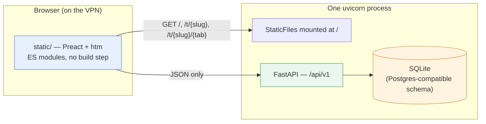
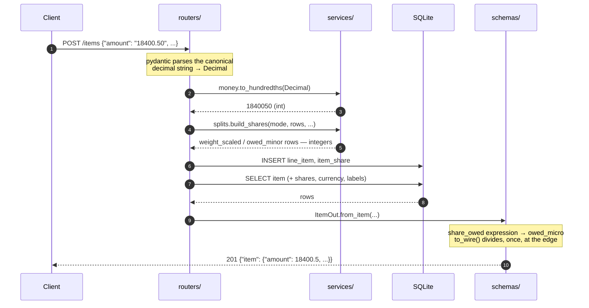
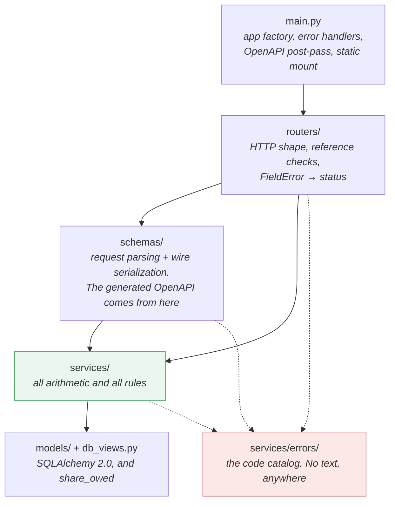
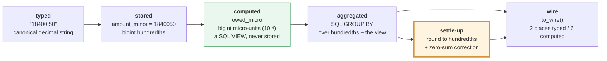
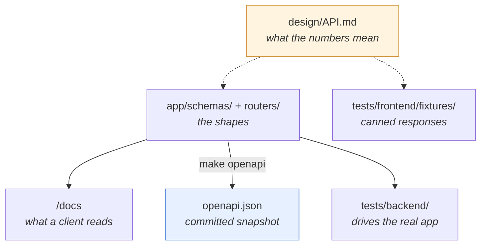
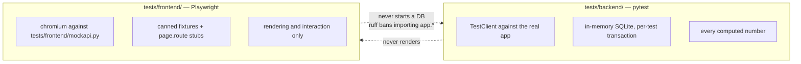
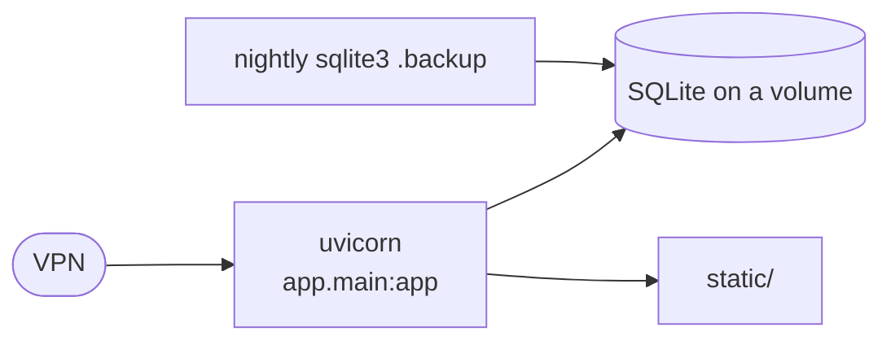

# Trip Accounter — Architecture

A holiday expense tracker: a group logs what it spent across several countries and
currencies, and the app says who owes whom when the trip is over. One process, one
SQLite file, a VPN as the perimeter, no user accounts.

The whole system is **two halves that share nothing but a contract**: a FastAPI JSON
API under `/api/v1`, and a static Preact page served from `/`. Neither imports the
other. That is not incidental — it is the constraint every other decision here is
downstream of, and [`DECISIONS.md`](DECISIONS.md) records why.

---

## 1. The shape of it

The static mount is a **deployment convenience**, nothing more. The API has no
knowledge of what sits in `static/`, serves `index.html` for `/`, `/t/{slug}` and
`/t/{slug}/{tab}` without looking at the slug or tab, and never returns HTML under
`/api/v1`. Point the frontend at another origin and the only change is a
`CORSMiddleware` line.

**A tab is a URL** (`/t/{slug}/{tab}`) but not a page load: `app.js` intercepts the
link click (and the back/forward buttons) and re-renders in place, so `/t/{slug}/{tab}`
only ever hits the server on a direct link, a bookmark, or a hard refresh. `ETagMiddleware`
(`app/main.py`) gives every `GET /api/v1/...` response a content hash as its `ETag`
plus `Cache-Control: no-cache`, so even that cold load can come back as an empty
`304` when nothing changed since the last visit.

**The static half is versioned rather than revalidated.** With `TA_BUILD_ID` set, the
static mount moves from `/` to `/s/{build_id}/` and `index.html` is served with its
own two asset references rewritten to match — a relative `import` inside a module
inherits the prefix for free, so nothing under `js/` is ever rewritten and no build
step appears. Every asset URL is then unique to its build, which is what lets the
proxy in front cache them permanently; `index.html`, which names the build id, is the
one file kept on `no-cache`. Unset, the assets sit at `/` uncacheable, which is what
the dev server wants. [`../DEPLOY.md`](../DEPLOY.md) has the nginx side.

## 2. One request, end to end

Three things this diagram is really saying:

- **Parsing happens at the top, formatting never happens at all.** A decimal string
  becomes a `Decimal` in `schemas/`, an `int` immediately after, and stays an `int`
  through every sum and every column. `to_wire()` divides once, in the serializer, and
  nothing downstream of it ever feeds back in.
- **The routers are thin.** They validate references, translate a `FieldError` into
  the right HTTP status, and hand off. Arithmetic lives in `services/`, shapes live in
  `schemas/`.
- **No presentation crosses the boundary.** The response carries `18400.5`, not
  `"18 400,50 kr"`. Digit grouping, the decimal separator, the `+` on a credit and
  the phrase "equally, 4 ways" are all browser-side, because only the browser knows
  the locale.

## 3. Module layers

`services/errors/` is drawn apart because everything reaches for it and it depends on
nothing. It holds the `{code, params}` catalog and **not one word of English** — see
[`BACKEND.md`](BACKEND.md) §4.

## 4. How money moves

This is the part worth reading twice. The rule is: **integers inside, plain JSON
numbers at the edge, rounded exactly once in the whole system.**

- **Only what a human typed is stored** — `amount`, an `exact` share, a weight — as
  integers. A computed share is never written to a column.
- **A computed share is a SQL view** (`share_owed`), `amount × weight / Σweight` in
  integer arithmetic at micro-unit scale, floored. Deterministic on SQLite and
  Postgres alike. Because it is floored rather than allocated, **nobody absorbs a
  remainder**: an item's shares may sum a few micro-units under the total, which is
  invisible at two decimals.
- **Balances and statistics are `GROUP BY` aggregates** over hundredths and that view.
  The client never adds a column of money.
- **The orange box is the only rounding in the system.** Nets are rounded to
  hundredths, the largest rounding error is corrected first (ties by `sort_order`) so
  the column sums to zero exactly, and then a greedy minimum-transfer plan produces at
  most n−1 payments per currency.

`|Σ net|` per currency is therefore within a few micro-units of zero rather than
exactly zero, and `Σ suggestions` is exactly zero. Both are asserted, from both sides.

**No currency is ever converted server-side.** Balances and each currency's own
statistics are per currency, full stop. The only conversion anywhere is each page's
own Total section — on both balances and statistics — a switch alongside the
currencies that multiplies by rates the user typed into their own browser (shared
between the two pages, one rate set per trip) and only computes once every
currency has one — those rates are never sent here and never stored.

## 5. The contract seam

The two halves meet at one place, and each fact about it has one home:

| Fact | Lives in | Kept honest by |
|---|---|---|
| fields, endpoints, statuses | `app/schemas/` + the routers | FastAPI validates every response against the declared envelope |
| the browsable reference | `/docs`, and `openapi.json` as its snapshot | `make openapi-check` — CI fails on a stale copy, so a shape change lands as a reviewable diff |
| what a number means, which rule yields which code | [`API.md`](API.md) | `tests/backend/test_validation.py` walks its §4 table row by row; `tools/check_i18n.py` matches its codes to the frontend catalogs |
| what a response looks like to a browser | `tests/frontend/fixtures/` | copied from what the backend actually produced |

**One fact, one place.** The project once carried a second, hand-encoded copy of the
shapes so the frontend could be built against a clickable contract before the backend
had routes. It was deleted once both halves ran against the real app: two encodings of
one contract is a drift generator, not a safety net.

## 6. Test topology

The split is **by what a test needs**, not by what it touches.

`tests/backend/` owns the database and every arithmetic assertion. `tests/frontend/`
never starts a database, never imports `app.*`, and **never asserts that a number is
correct** — only that what the server returned is what got rendered. Whether 18 400
ISK across four people is 4 600 each is asked in exactly one file, and it is a backend
one.

Anything under `tests/` follows [`skills/writing-unit-tests`](../skills/writing-unit-tests/SKILL.md).

## 7. Deployment

`uv sync --frozen --no-dev && alembic upgrade head && uvicorn app.main:app`. No JS
toolchain, so `uv sync` is the entire build; the Dockerfile is a convenience, not a
requirement. Postgres works unchanged — the schema is kept compatible and the share
view relies only on integer division, which floors identically on both.

> **No authentication exists.** Anyone who reaches the host can read and modify every
> trip. That is acceptable only while the VPN is the sole path in. If it ever needs to
> be public, the smallest correct step is unguessable slugs plus rate limiting, and
> real accounts after that.

---

## Where to go next

| Document | What it fixes |
|---|---|
| [`DECISIONS.md`](DECISIONS.md) | every locked decision and the alternative it beat |
| [`API.md`](API.md) | the contract: what the numbers mean, the error catalog, the validation rules |
| [`ERD.md`](ERD.md) | entities, invariants, the share view, indexes |
| [`BACKEND.md`](BACKEND.md) | how `app/` is laid out and why each layer exists |
| [`FRONTEND.md`](FRONTEND.md) | how `static/` is laid out, and the rules that keep it from computing money |
