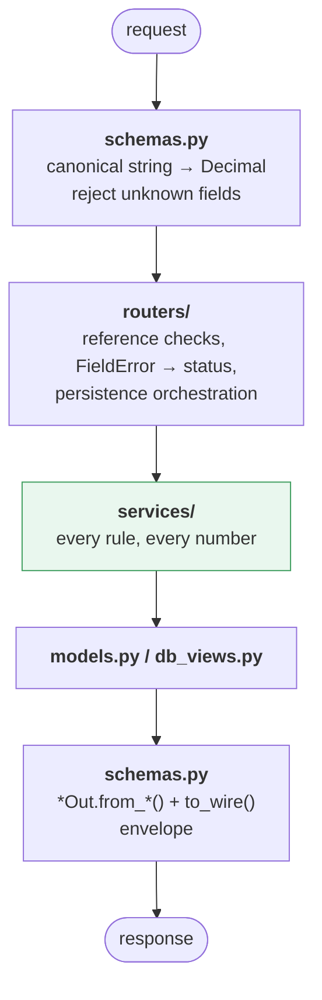

# Backend Architecture — `app/`

**Owns**: the data model, migrations, all money arithmetic and aggregation, the JSON
API, the generated OpenAPI snapshot, the demo seed, export, and the repo tooling.

**Owns nothing under `static/`, and emits no presentation whatsoever** — no HTML, no
templates, no display strings, no `+` signs, no thousands separators, no split
phrases. Plain numbers and structured data. It does not know a frontend exists.

---

## 1. Layout

```
app/
├── main.py             app factory, error handlers, the OpenAPI post-pass,
│                       StaticFiles at /. No routes of its own but / and /t/{slug}.
├── config.py           pydantic-settings: DB url, static dir. TA_-prefixed.
├── db.py               engine + the Session dependency
├── db_views.py         the share_owed view, mapped read-only
├── deps.py             SessionDep, TripDep — slug → Trip or 404
├── clock.py            the injected clock behind occurred_at/created_at defaults
├── models.py           SQLAlchemy 2.0 models — see ERD.md
├── schemas.py          pydantic v2: request parsing + wire serialization + the
│                       response envelopes. The OpenAPI schema is generated from here.
├── seed.py             the demo trip `make seed` writes to the dev database
├── services/
│   ├── money.py        to_hundredths(Decimal), to_wire(int, scale) -> JSON number,
│   │                   scale_weight(Decimal) -> int. No parsing, no formatting.
│   ├── parsing.py      the canonical grammars: amount, weight, coordinate
│   ├── splits.py       build/validate share rows, exact-sum check, pad to roster
│   │                   order; resolve_shares_wire is the view expression in Python
│   ├── settle.py       round nets to hundredths with the zero-sum correction, then
│   │                   the greedy plan. THE one place money is rounded.
│   ├── balances.py     per-currency paid/owed/net via SQL aggregates
│   ├── stats.py        by_label / by_country / by_person / by_day, per currency
│   ├── roster.py       people / currencies / countries CRUD + the in-use guards
│   ├── labels.py       normalize, get-or-create, use_count
│   ├── countries.py    flag from ISO code
│   ├── slugs.py        slugify + collision suffix
│   ├── geo.py          parse lat/lon out of a maps URL when not given
│   ├── export.py       CSV (one row per share) and JSON (whole trip)
│   └── errors.py       the {code, params} catalog. No text. Depends on nothing.
└── routers/
    ├── trips.py  items.py  people.py  currencies.py  countries.py  labels.py
    ├── reports.py      balances + stats
    └── export.py
```

No `pages.py`, no Jinja, no `python-multipart`. `GET /` and `GET /t/{slug}` return
`static/index.html`; the backend does not look at the slug there.

## 2. What lives in which layer



The rule of thumb: **if it decides a number, it is in `services/`. If it decides a
status code, it is in `routers/`. If it decides a shape, it is in `schemas.py`.**

A router never does arithmetic. A service never raises an `HTTPException` — it raises
a `FieldError`, and `run_field(field, fn, ...)` addresses it to the right request
field with the right status (`409` for a naming or reference conflict, `422` for
everything else). A serializer never queries.

## 3. The one thing to understand before changing anything

Money is integers, and there is exactly one rounding step.

| Stage | Representation | Where |
|---|---|---|
| typed in | canonical decimal string, ≤ 2 fraction digits | `services/parsing.py` via `schemas.py` |
| stored | `bigint` hundredths (`amount_minor`, `owed_minor`), weights ×10⁴ | `models.py` |
| computed share | `bigint` micro-units, floored, **a view** | `db_views.share_owed` |
| aggregated | SQL `GROUP BY` over both | `services/balances.py`, `services/stats.py` |
| **rounded** | **hundredths, zero-sum corrected** | **`services/settle.py` — the only one** |
| wire | plain JSON number, 2 places typed / 6 computed | `money.to_wire` in `schemas.py` |

Consequences that are easy to trip over:

- **`to_wire` output never feeds back in.** It is called once, in a serializer. A
  float must never reach a column or a sum.
- **`resolve_shares_wire` and the `share_owed` view must agree**, because
  `preview-split` uses the first and a saved item uses the second, and a form whose
  live numbers differ from what gets saved is the worst bug this app can have.
- **There is no `allocate()`.** Shares are floored, so an item's shares may sum a few
  micro-units under its amount. That is intended: nobody absorbs a remainder.
- **`equal` is `shares` with every weight 1** — the same expression, not a second
  branch.

## 4. Errors carry no language

`services/errors.py` is the whole catalog, and it contains **no sentence, no template,
no fallback, no default word, no locale** — nor does anything else in `app/`. The
backend never sees `Accept-Language` and has nothing to translate.

```
FieldError            one {code, params} attached to a request field
  ConflictFieldError  the subset that means 409 rather than 422
ApiError              the {error: {code, params, fields?}} envelope + its status
```

Both register their subclasses by `code` at definition time, so `FIELD_ERROR_PARAMS`
and `TOP_LEVEL_PARAMS` are *derived*, never hand-written — one source of truth per
code. `FieldError.by_code` exists for exactly one purpose: bridging a third-party
string-keyed error (pydantic's own `type`, a `ParseError` code) back into the catalog.

Adding a rule means: a row in [`API.md`](API.md) §4, a class here, and an
`err.<code>` key in **every** frontend catalog — in the same commit.
`tests/backend/test_errors.py` and `tests/frontend/test_i18n.py` fail otherwise, and
so does a catalog code that no functional test ever triggers, because a dead code is
drift.

## 5. The generated OpenAPI

Every route declares a `response_model` (an envelope from `schemas.py`) and the exact
error statuses it can answer with, via `schemas.error_responses(...)`. Two things fall
out of that:

- `/docs` is the shape reference, and `make openapi` writes the same schema to
  `openapi.json` at the repo root. The snapshot is committed so a shape change shows
  up as a diff in the commit that makes it; `make openapi-check` is the CI gate.
- FastAPI validates every response against its declared envelope, so a serializer
  that drifts from the contract fails a test rather than shipping.

`main.strip_default_validation_error` removes FastAPI's own `HTTPValidationError` 422
from the generated document: this API answers 422 with its own envelope, declared per
route, so a leftover reference would document a body the app never emits.

## 6. Tests — functional first

A backend test drives the app **the way a client does**: a request through
`TestClient`, an assertion on the status and the JSON body. The unit under test is a
*behaviour of the API*, not a Python function. `app.services.*` has no test file of
its own — a service is covered by the endpoints that use it, because that is the only
place its output is observable to anyone.

Three reasons this is the default:

1. **The contract is the deliverable.** A test that calls `splits.build_shares()`
   proves nothing about whether `POST /items` honours it; a test that posts an item
   proves both.
2. **Services are expected to move.** Tests written against the wire survive a
   rewrite; tests written against function signatures have to be rewritten alongside,
   which is how a suite becomes the thing nobody dares refactor.
3. **Setup goes through the write path**, so a test cannot construct a state the API
   itself would reject — no orphan share, no item without a country, no float in a
   column.

**The one surviving direct-call layer is arithmetic** (`test_money.py`): parsing,
`to_wire`, the share expression and the settle-up rounding, where the interesting
cases are combinatorial and routing each through HTTP would buy nothing but runtime.

Not tested at all: private helpers, SQL text, the shape of an ORM object, that a
service was called. If a behaviour cannot be observed in a response, an export file,
or the database after a request, it is not a behaviour.

### Which file a test belongs in

The mapping is **by capability, not by module**: a test goes where its *question*
lives, which is rarely where the code that answers it lives.

| File | Covers |
|---|---|
| `test_trips.py` | `/trips` CRUD, slug generation and collisions, cascade on delete |
| `test_items.py` | item CRUD, list order, partial `PATCH`, `map_url` coordinate parsing, ids from another trip |
| `test_splits.py` | every split mode end to end, roster padding, `0` vs `null`, `preview-split` matching a saved item byte for byte |
| `test_roster.py` | `/people`, `/currencies`, `/countries` — the uniform CRUD shape, `409 duplicate`, `409 in_use`, `active: false` |
| `test_labels.py` | auto-create, case-folding, the whitespace rejection, `use_count`, suggestion order |
| `test_balances.py` | `net == paid − owed`, the zero-sum bound, suggestions replayed to prove they settle |
| `test_stats.py` | group totals against the trip total, the deliberate `by_label` overlap, `by_person` as owed |
| `test_export.py` | both formats, the pinned CSV header, an empty trip |
| `test_validation.py` | the `API.md` §4 table, row by row, each as a real request |
| `test_errors.py` | catalog ↔ contract ↔ wire consistency; no `message` key anywhere |
| `test_http.py` | malformed JSON, unknown fields, `204` bodies, the `500` correlation `ref` |
| `test_static.py` | `/` and `/t/{slug}` serve `index.html`; nothing under `/api/v1` returns HTML; the versioned asset mount under `TA_BUILD_ID` and the unversioned one without it |
| `test_money.py` | **the only file that imports a service** — parsing, `to_wire`, the share expression, settle-up rounding |
| `test_import_sheet.py` | `tools/import_sheet/` — cell grammars, date shapes and split inference called directly; `fixtures/sheet.csv` imported through `session` and read back over `client` |

Full conventions, fixtures, pitfalls and review rules:
[`skills/writing-unit-tests`](../skills/writing-unit-tests/SKILL.md) — mandatory for
every change under `tests/`.

## 7. Running it

```bash
make install_dev     # uv sync + chromium + lefthook hooks
make migrate seed    # dev.db with the demo trip
make start_dev_server
make test
make openapi         # regenerate the committed spec after a shape change
```

Pre-merge gate is `make lint test_backend`; lefthook runs it on push and CI runs the
same targets.
