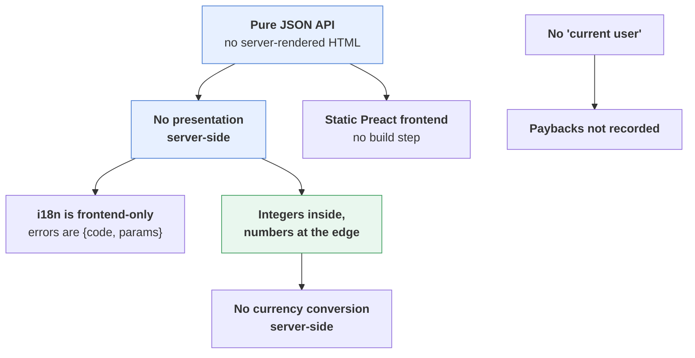

# Trip Accounter — Decisions

What was decided, and what it beat. A decision listed here is not re-litigated
casually: several of them are load-bearing for the others, and the dependency runs in
one direction.

---

## 1. The locked set

| Topic | Decision |
|---|---|
| **Auth** | None. The VPN is the perimeter. A trip is reachable at `/t/{slug}`. |
| **Backend** | **Pure JSON REST under `/api/v1`.** No templates, no HTML fragments, no form posts. It knows nothing about the frontend; the frontend is one client among any. Static files are mounted at `/` as a deployment convenience only. |
| **Frontend** | **Static, client-rendered.** Preact + htm as ES modules through an import map, Bootstrap 5 for the modal and tabs, pinned versions with SRI hashes. No build step, no Node, no npm at runtime. |
| **Currency** | Multi-currency, **zero conversion server-side**. Balances, settle-up and each currency's own stats are strictly per currency. The stats page's Total section converts client-side with rates the user types, kept in `localStorage`, and only computes once every currency has one. |
| **i18n** | **Frontend-only, from the first commit.** `en` (source) and `cs` as flat ES modules; `t()` over `Intl.PluralRules` / `NumberFormat` / `DateTimeFormat`, no library. Adding a language is one file plus one line. **The API has no language at all**: errors are `{code, params}` with no message, amounts cross the wire in one canonical grammar, and `app/` contains no user-facing string. |
| **Money** | **Only typed values are stored, as integer hundredths, for every currency.** Computed shares are a SQL view in integer micro-units, never stored, never rounded per item. Balances and stats are `GROUP BY` over hundredths and that view. Input is a canonical decimal string; output is plain JSON numbers — typed to 2 places, computed to 6. **Rounded exactly once**, in settle-up, with a zero-sum correction. No `Currency.decimals`, no `*_display`, no `*_minor` on the wire. |
| **Splits** | Equal by default; override to weighted shares or exact amounts. Computed server-side only; `preview-split` gives the form live numbers from the same expression that will be saved. |
| **Paybacks** | **Not recorded.** The app computes who owes whom; the humans settle once at the end. No settlement table, no "Mark paid". |
| **Viewer** | **No "current user" anywhere.** An item states who paid and what each person owes. Nothing is rendered relative to a viewer. |
| **Countries** | A strict per-trip list, **required on every item**. Managed in Setup like people and currencies; the item form only picks. Independent of currency. |
| **Labels** | Free-typed, many per item, trip-scoped, auto-created on first use. **Space-separated in the input**, so one label is one token — `street-food`, never `street food`. Always an array on the wire. |
| **Slug** | Generated from the trip name, `-2`/`-3` on collision, immutable afterwards. |
| **DB** | SQLite via SQLAlchemy 2.0 + Alembic, schema kept Postgres-compatible. Python ≥ 3.13. |
| **Tooling** | **uv** for dependencies and lockfile. **Makefile** as the only UX. **lefthook** hooks: ruff on staged files at commit, lint + backend tests at push. **GitHub Actions** runs the same make targets. |

---

## 2. Why not the obvious alternatives

### Why not Jinja or HTMX
Both make the backend render HTML for one specific frontend. That is exactly the
coupling this design removes: the API has to be usable by a script, a phone shortcut
or `curl`. HTMX in particular is hypermedia by definition and cannot sit on a pure
JSON API without a second template layer in the browser anyway.

### Why Preact + htm, not vanilla, Vue, or a Vite build
Real components for the modal, the split editor and the label chips, at about 5 KB,
with no toolchain. htm is HTML in tagged templates, so markup ports almost verbatim.
Vue's CDN build would also work and is heavier; vanilla is where 150 lines becomes
600 and state bugs live; a Vite build buys nothing at this size and costs a Node
dependency in every environment. Because the backend is decoupled, this choice is
swappable later without touching it.

### Why integers rather than `Decimal` all the way down
JSON has no decimal type, so the wire is float64 regardless. Storing integers means
the database and every sum are exact by construction, and the one place precision
could be lost — the division that makes a share — is pushed into a floored integer
expression whose error is bounded at 10⁻⁶ per share and never accumulates.

### Why a SQL view rather than an `allocate()` helper
An allocator has to hand the remainder cent to *somebody*, which is a policy decision
that then has to be stable across edits, exports and re-reads. A floored view has no
remainder to hand out: everybody is a few micro-units short, invisibly, and the money
is reconciled once at settle-up where a human is looking anyway. It is also set-based,
so balances and statistics stay one query as a trip grows.

### Why no currency conversion server-side
A stored rate is a lie with a timestamp. Rates are the user's own guess about what
they will actually pay, they differ per person and per card, and persisting one would
make every historical balance depend on when it was computed. Per-currency balances
are always true; the Total section's figures are explicitly the user's own arithmetic,
in their own browser, never sent back — and it shows nothing at all until every
currency has a rate, rather than a partial sum that silently drops the ones missing
one.

### Why no "current user"
There are no accounts, and a trip is shared by URL. Any "you owe" framing would have
to guess who is holding the phone. Stating who paid and what each person owes is both
simpler and correct for every viewer.

### Why paybacks are not recorded
A settlement table turns a holiday tracker into a ledger with its own reconciliation
problems, for a workflow that happens once. If it ever matters, a
`SETTLEMENT(from, to, currency, amount)` entity slots in additively — `net` gains
`+ sent − received` and nothing else moves.

### Why no authentication
The VPN is the perimeter and the trust boundary is a group of people who are already
on holiday together. This is a real limitation, not an oversight — see the warning in
[`ARCHITECTURE.md`](ARCHITECTURE.md) §7.

---

## 3. Deliberately out of scope

Receipt photos, recurring expenses, per-item comments, a map view of all pins, undo
history, PWA/offline, item-list filters and pagination, more than two languages. The
model and the API leave room for each; none is needed to settle a holiday.
