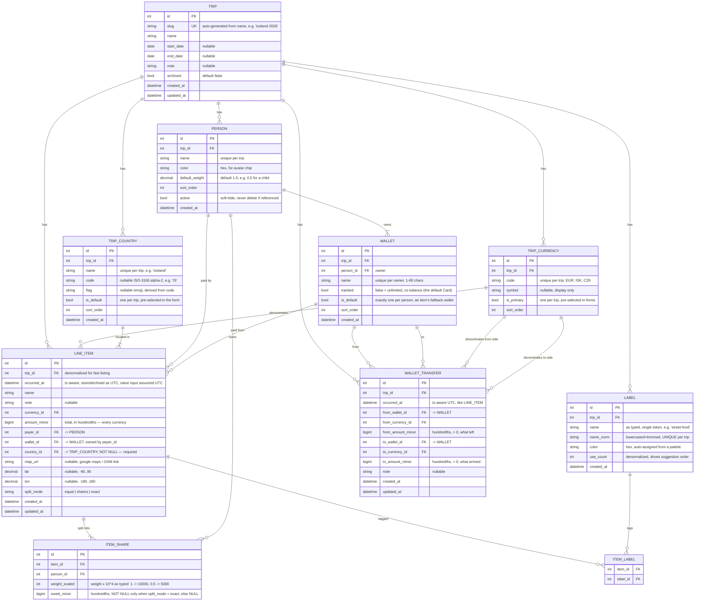

# Trip Accounter — Data Model (ERD)

Scope: single deployment behind VPN, **no user accounts**, no authentication.
A Trip is reachable at `/t/{slug}`. Everything inside a Trip (persons, currencies,
labels, items) belongs to that Trip only.

## Diagram



## Rules and invariants

**Trip slug**
- Generated from `name`: lowercase, strip accents (`Vík` → `vik`), non-alphanumerics
  to `-`, collapse repeats, trim to 60 chars. `"Iceland 2026"` → `iceland-2026`.
- On collision append `-2`, `-3`, … Empty result falls back to a 8-char random token.
- Immutable after creation — renaming a trip does not move its URL, so pasted links
  keep working.

**Money**
- **Only what a human typed is stored, always in hundredths**, for every currency:
  `LINE_ITEM.amount_minor`, `ITEM_SHARE.owed_minor` (exact mode only). Weights are
  stored as typed, scaled ×10⁴ to stay integer. **Never a float in the database**,
  and never a float in any arithmetic.
- **Computed shares are not stored.** A view derives them in integer arithmetic at
  micro-unit scale:

  ```sql
  CREATE VIEW share_owed AS
  SELECT s.item_id, s.person_id, i.trip_id, i.currency_id, i.occurred_at,
         COALESCE(s.owed_minor * 10000,                                     -- exact: typed
                  i.amount_minor * 10000 * s.weight_scaled / w.total_scaled) -- else: floor
           AS owed_micro
  FROM item_share s
  JOIN line_item i ON i.id = s.item_id
  JOIN (SELECT item_id, SUM(weight_scaled) AS total_scaled
        FROM item_share GROUP BY item_id) w ON w.item_id = s.item_id;
  ```
  Integer division floors identically on SQLite and Postgres for positive operands,
  so the result is deterministic. Under one micro-unit is lost per share; an item's
  shares may sum a few micro-units short of `amount_minor × 10⁴`. No cent is ever
  allocated to a person per item, so there is no remainder and nobody absorbs one.
- The **wire** form: the JSON API emits a plain number in the currency's own units —
  `amount_minor / 100` for typed values (two places), `owed_micro / 10⁶` for computed
  ones (six) — and takes a **canonical** decimal string on input
  (`^-?[0-9]+(\.[0-9]{1,2})?$`). Locale parsing is the client's; the server never
  sees a typed separator. Conversion happens once, in the serializer at the edge.
  See `API.md` § Money.
- Three-decimal currencies (KWD, BHD, OMR) cannot be typed to their last digit.
  Accepted limitation.
- **No currency conversion happens server-side, ever.** Balances are computed and
  displayed *per currency*. A trip with EUR + ISK produces two independent balance
  tables and two independent settlement suggestions.
- Both the Statistics and Balances pages' Total switch may show a converted sum (or,
  for Balances, converted-and-netted settle-up suggestions) across currencies, but
  the rates are typed by the user in the browser, live **only** in the browser
  (`localStorage`, shared between the two pages), and the Total shows nothing until
  every currency has one. Never sent to the API, never stored in the DB.

**Splits**
- `split_mode = equal`: a row per selected person, `weight_scaled = 10000`,
  `owed_minor NULL`. The view computes the share.
- `split_mode = shares`: arbitrary weights (1, 1, 0.5 for a child), `owed_minor NULL`.
  `equal` is `shares` with all weights 1 — same view expression.
- `split_mode = exact`: `owed_minor` typed directly in hundredths, must sum to
  `amount_minor` exactly (service check, `sum_mismatch`); `weight_scaled` still
  stored as typed or `10000`, ignored by the view because `COALESCE` picks the typed
  value.
- **No per-item rounding.** The share is a fraction, floored at 10⁻⁶. The only place
  money is rounded is settle-up (below), once, across the whole trip.
- `CHECK ((split_mode = 'exact') = (owed_minor IS NOT NULL))` on `item_share` via the
  parent's mode, enforced in the service and asserted by a test over the seeded DB.
- `UNIQUE (item_id, person_id)` — a person appears at most once per item.
- The payer need not be among those who owe (you can pay for a meal you did not eat).
- **The app has no "current user".** An item just records who paid and what each
  person owes. Nothing in the schema or the UI is relative to a viewer.

**Countries**
- A **strict, trip-scoped list**. An item **must** reference one — `country_id` is
  `NOT NULL`. There is no free-text country and no "unspecified".
- Managed in Setup only, exactly like people and currencies — the expense form
  picks from the list, it never creates. Keeps the form to one decision per field.
- Independent of currency. A purchase in Denmark can be charged in EUR; the country
  says where you were, the currency says what was charged.
- `code` is optional ISO-3166 alpha-2; when present, `flag` is derived from it
  (regional indicator pair). A country typed by hand with no code simply has no flag.
- `is_default` seeds the form; the browser then remembers the last country used on
  this trip, which is what actually matters when you cross a border mid-trip.
- A country in use cannot be deleted — the UI says which items hold it.
- Trip creation requires at least one country, so the form is never unusable.

**Labels**
- Free text, **many per item**, trip-scoped. No fixed category list.
- **One token per label** — no whitespace inside one. The API rejects a token with
  whitespace (`422`); the frontend's chip input commits a chip on space, so it never
  sends one. Typing `street food` yields two labels unless the user writes
  `street-food`.
- Matching is on `name_norm` (`casefold()`, trimmed, leading/trailing `-` stripped) so
  `"Food"`, `"food"` and `" food "` are the same label; the first-typed casing is kept
  for display in `name`. `name_norm` is internal and never on the wire.
- The API takes `labels` as an array of tokens, always.
- Creating an item with an unknown label creates the label on the fly.
- The input suggests existing trip labels ordered by `use_count DESC, name ASC`.
  The server order is what clients show; there is no locale-aware re-sort.
- **The server seeds no labels.** `POST /trips` accepts an optional `labels` list;
  the bundled frontend sends a fixed starter set the user can untick. Labels are
  user data and are never translated, so the set is the same in every locale.
- `use_count` maintained on attach/detach; a label with `use_count = 0` is
  suggestable but can be deleted with no consequences.
- Deleting a label removes its `ITEM_LABEL` rows only — items survive untouched.

**Balances** (per trip, per currency)
```
paid_micro[p]     = Σ LINE_ITEM.amount_minor × 10⁴   where payer_id = p
owed_micro[p]     = Σ share_owed.owed_micro           where person_id = p
sent_micro[p]     = Σ WALLET_TRANSFER.from_amount_minor × 10⁴
                      where from_wallet.person_id = p AND from_wallet.person_id <> to_wallet.person_id
received_micro[p] = Σ WALLET_TRANSFER.to_amount_minor × 10⁴
                      where to_wallet.person_id = p AND from_wallet.person_id <> to_wallet.person_id
net_micro[p]      = paid_micro[p] − owed_micro[p] + sent_micro[p] − received_micro[p]
```
One `GROUP BY` over the view per currency, plus two more over `WALLET_TRANSFER`
joined to `WALLET` twice (from/to) filtered to cross-owner rows. `net > 0` → is owed
money. `net < 0` → owes. `|Σ net_micro| ≤ number of shares` per currency (floor
loss), not exactly zero. A transfer between one person's own wallets, plain or
exchange, contributes to neither `sent` nor `received` — it moves nothing between
people.

**Who pays whom** — the single rounding step in the system:
1. `net_cents[p] = round(net_micro[p] / 10⁴)` for every active person.
2. While `Σ net_cents ≠ 0`: adjust by one cent the person with the largest rounding
   error, ties by `PERSON.sort_order`. Deterministic; at most n steps.
3. Greedy min-cash-flow on `net_cents`: repeatedly match the largest creditor with the
   largest debtor. At most n−1 transfers per currency, in hundredths, summing to zero.

Settling a *suggestion* happens after the trip at a rate the humans agree on; the app
only says "Bob → Ann: 4 200 ISK" and never marks one paid — there is still no table of
settle-up payments. The `SETTLEMENT(from, to, currency, amount)` entity this document
used to reserve for "if mid-trip paybacks ever matter" is exactly what
`WALLET_TRANSFER` became once a transfer crosses owners: recorded, real, and additive
to `net` via `+ sent − received`, precisely as anticipated. It is a distinct concept
from a suggestion, though — a suggestion is never recorded, a transfer always is.

**Location**
- `map_url` and `lat`/`lon` are both optional and independent.
- Written as themselves through the API. On save, if `map_url` is given and
  coordinates are absent, try to parse `@lat,lon` / `!3dlat!4dlon` / `?q=lat,lon` out
  of it. Best-effort — a failure is not an error. Explicit `lat`/`lon` win.
- If `lat/lon` present and `map_url` absent, the UI renders a generated maps link.

**Deletion**
- Trip → cascade everything (one holiday, one blob).
- Person → blocked if referenced by an item/share, or if any of their wallets
  appears in a transfer; offer `active = false` instead, which hides them from
  new-item forms but keeps history intact.
- Currency → blocked if referenced by an item or a transfer.
- Country → blocked if referenced. Never soft-deleted: an item always has a real one.
- Line item → cascades its shares and its `ITEM_LABEL` rows.
- Label → cascades `ITEM_LABEL` rows only.
- Wallet → blocked if it is a person's `is_default` wallet, or if any item or
  transfer still references it (`in_use`, count = items + transfers).
- Person → wallets cascade (a person's wallets go with them). Trip → transfers cascade.

**Wallets and transfers**
- Every person gets one wallet on creation, named `Card`, untracked and
  `is_default` — server-assigned, the one seeded user-visible string in `app/`. An
  item omitting `wallet_id` falls back to the payer's default; a wallet not owned by
  the payer is `422 wallet_owner_mismatch`.
- `tracked` decides whether a wallet computes a balance at all; an untracked wallet
  is unlimited by design (no stored limit, ever).
- A transfer's two sides are independently typed (`from_amount_minor`,
  `to_amount_minor`, each with its own currency) — no stored exchange rate. Same
  currency both sides = a plain transfer; different currencies = an exchange, and an
  exchange is allowed only when both wallets share one owner (`422
  cross_owner_exchange` otherwise). The same wallet on both sides is meaningless
  unless it is an exchange (`CHECK (from_wallet_id <> to_wallet_id OR
  from_currency_id <> to_currency_id)`, backed by service-level `422 same_wallet`).
- A tracked wallet's balance: `received − sent − spent` per currency, where
  `received`/`sent` sum `WALLET_TRANSFER` amounts on that wallet's own side, and
  `spent` sums `LINE_ITEM.amount_minor` where `wallet_id` matches. Negative is the
  overcharge signal — the client renders the sign, the server just computes it.

## Indexes
```
trip(slug) UNIQUE                       trip(slug)
person(trip_id, name) UNIQUE            person(id, trip_id) UNIQUE
trip_currency(trip_id, code) UNIQUE     trip_currency(id, trip_id) UNIQUE
trip_country(trip_id, name) UNIQUE      trip_country(id, trip_id) UNIQUE
label(trip_id, name_norm) UNIQUE        label(name_norm)
item_label(item_id, label_id) PK
line_item(trip_id)                      line_item(occurred_at)  line_item(payer_id)
line_item(currency_id)                  line_item(country_id)   line_item(wallet_id)
item_share(item_id, person_id) UNIQUE   item_share(item_id)     item_share(person_id)
wallet(person_id, name) UNIQUE          wallet(id, trip_id) UNIQUE
wallet(person_id)                       wallet(trip_id)
wallet_transfer(trip_id, occurred_at)   wallet_transfer(from_wallet_id)
wallet_transfer(to_wallet_id)
share_owed                              VIEW — not a table, no index of its own
```

The roster's `sort_order` carries no index. `Trip.people`, `Trip.currencies`,
`Trip.countries` and `Person.wallets` declare `order_by` on the relationship, so
every load of one sorts on it — over the handful of rows a trip holds, which is why
the column is left unindexed.
