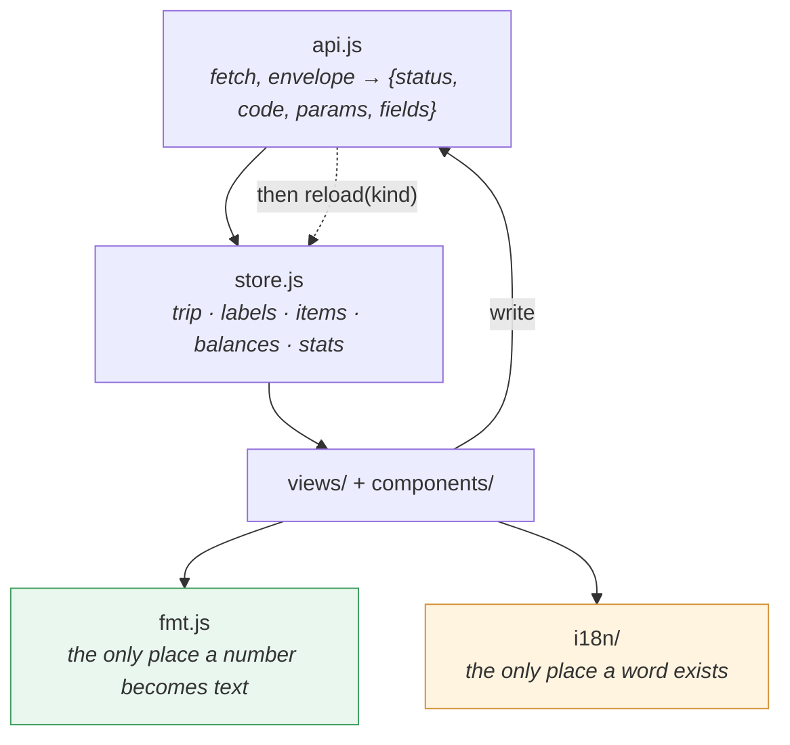

# Frontend Architecture — `static/`

**Owns**: everything under `static/`, plus `tests/frontend/mockapi.py` and
`tools/check_i18n.py`.

**Owns nothing under `app/`.** The API hands over **data, not presentation** — plain
numbers — and every bit of formatting is frontend work: digit grouping, the decimal
separator, the currency symbol, the `+` on a credit, the dash for a person left out,
and the split phrase ("equally, 4 ways", "shares 1·1·1·0.5").

---

## 1. Stack

Preact + htm as ES modules through an import map. No build step, no Node, no npm.
Pinned versions with SRI hashes. Bootstrap 5 CSS plus `bootstrap.bundle.min.js` for
the modal and tabs — Preact renders the markup, Bootstrap animates it. Bootstrap
Icons for glyphs. Roughly 500 lines of own JS.

**Localized from the first commit.** Two catalogs, `en` (the source of truth) and
`cs`; a third is one file plus one line. No i18n library: `t()` is about 40 lines over
`Intl.PluralRules`, `Intl.NumberFormat` and `Intl.DateTimeFormat`, which already do
the hard parts for every locale.

## 2. Layout

```
static/
├── index.html            <head>, pinned CDN tags + SRI, import map, <div id="app">
├── app.css               ~80 lines on top of Bootstrap. No framework rewrite.
└── js/
    ├── app.js            mount + router: / and /t/:slug/items|balances|stats|setup
    ├── api.js            fetch wrapper: base path, JSON,
    │                     error envelope → {status, code, params, fields};
    │                     attempt() runs a write and hands back that error
    ├── store.js          per-trip state: trip, labels, items, balances, stats;
    │                     load(), reload(kind), setStatsDims(dims)
    ├── breakdown.js      the statistics dimension chain and the currency on
    │                     screen, one set per trip — localStorage only, never sent
    ├── fmt.js            money(), signed(), parse(), date() — one cached
    │                     Intl.NumberFormat per locale
    ├── h.js              html = htm.bind(h)
    ├── rates.js          Total target currency + typed rates, one set per trip,
    │                     shared by the balances and statistics pages — localStorage
    │                     only, never sent
    ├── convert.js        rateFor(), convert(), combineGroup(), combineSuggestions() —
    │                     the money-combination math behind every page's Total
    ├── collapse.js       toggleCollapse(), showCollapse() — tiny Bootstrap Collapse
    │                     API wrappers, for a click that must also scroll natively
    ├── i18n/
    │   ├── index.js      LANGS, current locale, t(key, params), setLocale()
    │   ├── en.js         source catalog, flat dotted keys
    │   └── cs.js         same keys, Czech
    ├── views/
    │   ├── TripList.js  TripNew.js
    │   ├── Trip.js       header + nav-tabs, picks the tab view
    │   ├── Items.js      day groups (items + transfers merged), empty state, FAB
    │   ├── Balances.js   per-currency + Total, collapsible sections, jump-to sidebar
    │   ├── Wallets.js    one card per person, a balance row per tracked wallet's currency
    │   ├── Stats.js      per-currency + Total, collapsible sections, jump-to sidebar
    │   ├── Setup.js      composes the six setup sections
    │   └── setup/
    │       ├── PeopleSection.js  WalletsSection.js
    │       ├── CurrenciesSection.js  CountriesSection.js
    │       ├── LabelsSection.js
    │       └── TripSection.js  name / note / dates / link / export / archive
    └── components/
        ├── Shell.js        the one piece of chrome every route shares, app.js
        │                   renders it once around whichever view is current
        ├── ThemeLangMenu.js  language + theme, lives only in Shell
        ├── Loading.js      one spinner, everywhere a store field isn't ready yet
        ├── CollapsibleSection.js  one collapsed-by-default card; shares an
        │                          accordion parent with its siblings
        ├── SideNav.js      the jump-to sidebar + mobile pill row, shared by
        │                   any page with a currency-first layout
        ├── RatesForm.js    the "convert to" picker + one rate input per currency,
        │                   shared by every page with a Total
        ├── ItemRow.js  TransferRow.js  DayGroup.js
        ├── ItemModal.js  Expense/Transfer switch + two modes, one component
        ├── TransferFields.js  wallet selects, the from/to amount+currency pairs
        ├── SplitEditor.js  mode switch, weights/amounts, calls preview-split
        ├── LabelInput.js   space/comma-separated chips
        ├── Avatar.js  PersonChip.js  LabelBadge.js  Flash.js
        ├── AddToggle.js  FieldError.js  the add button and the field-level
        │                 error message, shared by every setup section
        ├── errText.js      error envelope → the translated message
        └── splitSummary.js  mode + weights → "equally, 4 ways" — UI wording, UI code
```

State keys are exactly the API's resource names: `trip` (with embedded `people`,
`currencies`, `countries`, `wallets`), `labels`, `items` (with `transfers`
alongside), `balances`, `wallets` (the balances report, its own lazily-loaded key),
`stats`.

## 3. Data flow



Note the dashed arrow: **a write is followed by a re-read, never by a local mutation.**

## 4. The seven rules

1. **Format, never calculate — with exactly one exception.** Amounts arrive as plain
   JSON numbers, some with six fraction digits (`owed`, `net`, `by_person`). Render
   them through `fmt.money(value)`, which does grouping, separators and **0–2 fraction
   digits** — nothing else. The extra places exist so the server never rounds per item;
   the screen never shows them. **Never add, subtract or accumulate a column of
   amounts**: they are float64, and the backend ships every total, subtotal and balance
   pre-summed from SQL over integers.

   A direct consequence: the feed's per-day, per-currency subtotal comes from
   `items.day_totals` — one `GROUP BY` alongside the item query, never a client-side
   sum over the day's rows. The same discipline holds on the statistics page: each
   level of a nested breakdown renders its own grouping's row — the API answers a
   chain's prefixes for exactly that — and no level is ever summed from the one
   below it.

   The exception is each page's own Total — on both statistics and balances: a switch
   alongside the currencies that multiplies each grouped total (statistics) or each
   person's net and each settle-up suggestion (balances, netted by unordered person
   pair) by a rate the user typed, **rounds each product to two places**, and sums
   those rounded figures across currencies. It is all-or-nothing — the Total renders
   nothing but the rate form until every currency has a positive rate, never a partial
   sum quietly missing one. That sum is the only place the frontend adds two amounts,
   and every operand is already the user's own guesswork. The rates live in
   `localStorage`, shared between the two pages so one typed rate set serves both, are
   never posted back, and never come near a currency's own balance, settle-up figure,
   or statistics — only its Total.

2. **No split computation.** `item.split.shares` arrives resolved: one entry per person
   in roster order, `owed: null` for anyone left out (render a dash), `owed: 0` meaning
   they are in the split and rounding gave them nothing. Map the list as given.
   `split.mode` and `weight` are for prefilling the form and for `splitSummary()`. Live
   numbers in the modal come from `POST /items/preview-split`, fired on `change` of an
   amount, a weight or a person checkbox — not on every keystroke. If the request
   fails, the preview greys out; it never guesses.

3. **Writes, then re-read.** After any successful `POST`/`PATCH`/`DELETE`, call
   `store.reload('items')` (or `'trip'`, `'labels'`, …) and let Preact diff. No
   client-side row insertion, no local mutation of amounts, no optimistic updates. One
   extra `GET` per save is the price of never being wrong.

4. **Errors are rendered from code + params; the server sends no text.**
   `error.fields[name]` is `{code, params}` — render `t('err.' + code, params)` under
   the matching input, and `t('err.' + error.code, error.params)` in the flash for a
   field-less error. A code the catalog does not know renders as the code and its params
   (`sum_mismatch · diff 3`) — ugly on purpose, and `test_i18n.py` makes sure it never
   ships. Numbers inside `params` go through `fmt` like any other number.

   **Input goes the other way.** The API takes canonical decimals only (`18400.50`), so
   `fmt.parse(text)` turns whatever the user typed in the current locale (`18 400,50`,
   `18,400.50`, `18400,5`) into canonical form before it is sent — for `amount`,
   weights, exact shares, `default_weight`, `lat`, `lon`. The server knows no
   separators; the client knows exactly one locale.

5. **Unknown fields are ignored**, so a backend addition can never break a view. This
   is what let the backend ship ahead of the frontend, and it stays true afterwards.

6. **Keys and formatters.** Every list render has `key=${id}`. `fmt.js` builds one
   `Intl.NumberFormat` per locale and caches it — constructing one per cell is the only
   real performance trap in this app.

7. **No literal UI text in a component.** Every user-visible string goes through
   `t(key, params)`; components contain keys, not words.
   - **Catalogs** are flat ES modules with `{name}` interpolation only.
   - **Plurals** are separate keys per CLDR category: `t('items.count', {n: 3})` picks
     `items.count.` + `Intl.PluralRules(locale).select(3)` — `one/other` for English,
     `one/few/many/other` for Czech. The catalog author never writes the rule; the
     browser has it.
   - **Numbers and dates never come from a catalog.** `fmt.money()` and `fmt.date()`
     take the current locale, so Czech renders `18 400,50` and `po 14. 9.` without a
     single translated string.
   - **Locale** is `localStorage['lang']`, else the first `navigator.languages` entry
     whose prefix is in `LANGS`, else `en`. `setLocale()` sets `<html lang>`, writes
     storage and re-renders the root — no reload.
   - **Text that is not the UI's** — item names, label names, country and person names
     — is user data and is never translated. Country flags are data. Error text arrives
     as a `code`. The API has no language.
   - **Adding a language** is: copy `en.js`, translate, add the code to `LANGS`.
     `test_i18n.py` refuses a catalog with a missing or extra key.

**`occurred_at` is tz-aware UTC on the wire, always.** `fmt.date()` / `fmt.dateTime()`
convert to the viewer's local time as part of formatting, the same way `fmt.money()`
hides the locale's separators, and the item form converts back before sending. A
component never parses or formats a date by hand, and the wire string is never treated
as the viewer's own wall clock.

## 5. Call budget per screen

A tab is a URL (`/t/{slug}/{tab}`) but a tab switch is still a client-side route
change, not a page load — `app.js` intercepts it, so `store.trip` and any tab
already visited stay in memory. Each tab loads only what it needs the first time
it opens; landing straight on a tab via a direct link or a hard refresh pays for
`trip` too, since nothing is cached yet.

| Screen | Calls | Notes |
|---|---|---|
| Trip list | 1 | `GET /trips` |
| Open a trip (Items tab) | 3, parallel | `GET /trips/{slug}`, `/items`, `/labels` |
| Balances tab, first open | 1 | `GET /balances` — `trip` is already in the store |
| Wallets tab, first open | 1 | `GET /wallets` — `trip` is already in the store |
| Stats tab, first open | 1 | `GET /stats?group_by=…` — `trip` is already in the store |
| Changing the breakdown | 1 | the chain is a new `group_by`, so the answer is refetched |
| Changing the shown currency | 0 | every grouping already carries every currency |
| Setup tab, first open | 0 or 1 | `GET /labels`, unless Items already loaded them |
| Balances/Wallets/Stats/Setup, cold (direct link) | 2 | `GET /trips/{slug}` plus that tab's own endpoint |
| Revisiting a loaded tab | 0 | already in the store |
| Open the edit modal | 0 | the item or transfer is already in `store.items`/`store.transfers` |
| Type in the modal | 0 | labels filtered from `store.labels` client-side |
| Change amount or split | 1 | `preview-split` on `change`, not on input — expense mode only, never for a transfer |
| Save an item or a transfer | 2 | the write, then `GET /items` (plus `/labels` if a new label was typed); a transfer or item write also invalidates `store.wallets`/`store.balances` so those refetch on next open |
| Setup edit | 2 | the write, then `GET /trips/{slug}` (or `/labels`) |

Anything above this is a bug, and `test_call_budget.py` says so. A cold `GET
/trips/{slug}` may still come back as a 304 (see `design/ARCHITECTURE.md` §1,
`ETagMiddleware`) — that saves bytes, not the request itself, so it still counts
here.

## 6. Working without the backend

```bash
make test_frontend   # no DB, no uvicorn, no backend
```

The suite runs against `tests/frontend/mockapi.py`, a generic engine that serves the
same `static/` directory the real app does plus the routes the fixture file declares.
**The fixture JSON is the source of truth**: every path, body and error envelope is
written in the file, and the engine knows nothing about trips, splits or balances.
The grammar, the resolution rules and the conftest fixtures are in
[`MOCKAPI.md`](MOCKAPI.md).

**It does no arithmetic, ever.** `preview-split` is a canned body in the fixture, a
resolved split was written out by hand, and nothing served is computed. The moment the
mock computes a split there are two implementations of the allocation rule, and the
frontend suite starts passing against the wrong one.

## 7. Tests

`tests/frontend/` owns rendering and interaction, and runs a real Chromium against
`tests/frontend/mockapi.py` serving canned JSON. It is the browser and the fixtures, and
that is all it needs — ruff bans an `app.*` import here, because a frontend test that
wants the database is a backend test in the wrong directory.

```
tests/frontend/
├── conftest.py          mock API on a free port, page fixture, route helpers
├── mockapi.py           the JSON-driven engine, see §6
├── fixtures/
│   ├── trip.json        the resting state: 4 people, 2 currencies, resolved splits
│   ├── empty.json       a trip with no items, for the empty states
│   ├── hostile.json     markup in names and labels, for escaping
│   └── errors/          one file per envelope: 404, 409_in_use, 422_shares, 500_html
└── test_*.py
```

**Two data mechanisms, and the choice is not a matter of taste.** Baseline `GET`s come
from the mock server — that is the app's resting state. Everything else — writes, error
envelopes, `preview-split`, slow or failing responses — is stubbed per test with
`page.route`, so a `409`, a mismatched-shares `422` or a 500 with an HTML body is one
line instead of a backend state that has to be manufactured.

**`preview-split` is always canned.** This suite asserts *"renders what the server
returned"*. Whether 18 400 ISK across four people is 4 600 each is a backend question,
asked in exactly one backend file. That is rule 2 as a test-layout rule.

**Fixture values are copied from what the backend actually produced**, and a fixture
is updated in the same commit as the contract change that moves it. The browsable
truth to copy from is `/docs` on a running server, or the committed `openapi.json`.

Anything under `tests/` follows
[`skills/writing-unit-tests`](../skills/writing-unit-tests/SKILL.md).
