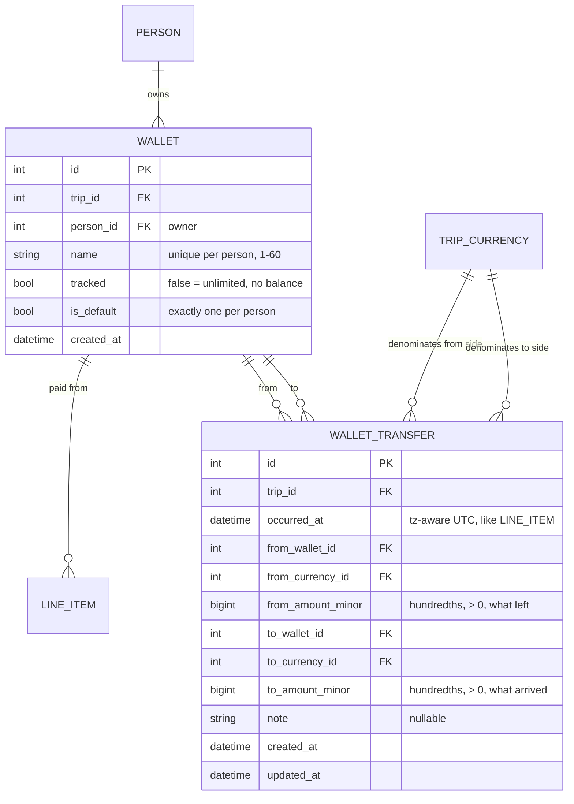

# Trip Accounter — Wallets

> **Status: shipped.** §1–§5 are the design record, folded into `ERD.md`, `API.md`,
> `DECISIONS.md`, `BACKEND.md` and `FRONTEND.md` as the code landed. §6–§9 were the
> implementation plan and have been deleted; `git log` on this file has them if
> ever wanted.

A wallet is a pot of money a person spends from: the card, an envelope of ISK cash, a
prepaid travel card. Every expense names the wallet it was paid from. Money moves
between wallets as a **transfer**, a new kind of row in the feed. A wallet is either
**tracked** — the app shows what is left in it per currency and flags an overcharge —
or **untracked**, in which case the wallet is nothing more than a fact recorded on the
item.

---

## What this lets you do

Written for whoever is on the trip, not whoever builds the app. Each numbered case
is something you can do once wallets ship; the tests in §9 play these same stories.

**1. Know how much cash you have left.**
Before the trip you add a wallet called *Cash* in Setup and switch it to *tracked*.
At the airport ATM you record a transfer: 20 000 ISK from *Card* to *Cash*. Every
cash purchase you log, you pick *Cash* as the wallet instead of *Card*. The Wallets
tab shows *Cash*: received 20 000, spent 18 400, left 1 600 ISK. When you spend more
cash than you ever put in, the row turns red with a warning — either you forgot to
log a withdrawal, or somebody else's cash paid and it should be on their wallet.

**2. Keep the card out of it.**
Your default wallet is *Card*. It is not tracked: no balance, no warning, no work.
Every expense lands on it unless you say otherwise, so if you never open Setup the
app behaves exactly as before. A wallet only starts asking for attention once you
mark it tracked.

**3. Withdraw abroad.**
The ATM charges your EUR account and hands you ISK. Record one transfer: from *Card*
20 EUR, to *Cash* 2 800 ISK. The app stores both amounts as you typed them and never
invents a rate. *Cash* shows +2 800 ISK; *Card* is untracked so it shows nothing.

**4. Exchange at a kiosk.**
Same thing between two of your own pots, or inside one: from *Cash* 20 EUR, to *Cash*
150 DKK. The Wallets tab now shows *Cash* with two rows, one per currency. Exchange
only works between your own wallets; the app refuses an exchange into somebody else's.

**5. Hand cash to a friend and have it count.**
Ann gives Bob 5 000 ISK because he is paying the guesthouse in cash. Record a transfer
from *Ann · Cash* to *Bob · Cash*. Both wallets move, and the Balances tab now says
Ann is owed 5 000 ISK more and Bob owes 5 000 ISK more — the same as if Ann had paid a
5 000 ISK expense that was entirely Bob's. Settle-up suggestions include it.

**6. Bring cash from home.**
You arrive with 500 EUR in an envelope. Record a transfer from *Card* to *Envelope*
500 EUR on the first day. *Card* is unlimited, so it is the natural source for money
that came from anywhere outside the trip.

**7. Fix a mistake.**
A purchase logged from *Card* was actually cash: open it, change the wallet, save.
A withdrawal you never made: open the transfer, delete it. The Wallets and Balances
tabs recompute on the next visit. If you change who paid, the wallet snaps back to
that person's default; if you pick a wallet the payer does not own, the app tells
you.

**8. Read the feed as a story.**
Transfers sit in the day-by-day list between the expenses, with an arrow icon, both
wallets named and the amount in grey so it does not read as spending. Day totals and
statistics stay expenses only: a withdrawal is not a cost. Untracked *Card*
purchases show nothing extra; a purchase from any other wallet shows the wallet's
name after the payer.

**9. Rename, reorganise, tidy up.**
In Setup you can rename *Card* to *Visa*, add a second card, make a different wallet
the default for someone, or delete a wallet nothing ever used. A wallet with
history cannot be deleted (the app says how many items and transfers hold it), and
neither can a person or a currency that a transfer still touches.

**10. Import an old spreadsheet.**
`tools/import_sheet` keeps working unchanged. Every imported row is paid from the
payer's *Card*; the sheet knows nothing about wallets and does not need to.

**What it deliberately does not do.** No budget or limit on a wallet (a tracked
wallet's balance *is* the limit). No stored exchange rate. No per-wallet statistics
page. No transfer that changes currency between two people.

---

## 1. Decisions

| Topic | Decision | What it beat |
|---|---|---|
| **Transfer storage** | A separate `wallet_transfer` table. `line_item` gains one column, `wallet_id`. | A `kind` column on `line_item`, and joined-table inheritance. Both make every `SUM(amount_minor)` in the codebase wrong until it filters by kind — six stats queries, `day_totals`, `total_spent`, the CSV export and the `share_owed` view — and both force a country and a fake share onto a transfer. Inheritance adds a table-rewriting migration and SQLModel polymorphism on top. A separate table changes the meaning of nothing that exists. |
| **One fetch for the feed** | `GET /items` answers `{items, day_totals, transfers}`. The frontend merges the two sorted lists by `occurred_at`. | A `UNION ALL` timeline from the server. Ordering rows by timestamp is not money arithmetic, so it is allowed client-side; the union is additive later if ever wanted. |
| **Cross-owner transfers** | Allowed. Ann's cash → Bob's cash makes Ann a creditor: `net = paid − owed + sent − received`. | Same-owner only. Handing cash to a friend is the most common real transfer, and this is exactly the additive `SETTLEMENT(from, to, currency, amount)` slot `DECISIONS.md` §2 reserved. **`DECISIONS.md` "Paybacks are not recorded" is amended:** settle-up suggestions are still never marked paid, but a transfer between two people's wallets is recorded and enters `net`. |
| **Default wallet** | The server creates `Card` (untracked, `is_default`) for every person, inside `roster.create_person`. Renameable. | The client supplying it. `curl` and the import tool would then have to know about wallets before they could create an item. `Card` is the one seeded user-visible string in `app/`, alongside the server-assigned `initial` and ISO-code country names; it is recorded as the exception, not a precedent. |
| **Wallet currency** | None. A wallet holds any currency; its balance is per currency, like everything else. | A currency per wallet plus an `initial_amount`. Funding a tracked wallet is a transfer into it from `Card`, which is unlimited; bringing 500 EUR from home is the same transfer. |
| **Currency exchange** | A transfer has two typed sides: what left the sending wallet and what arrived in the receiving one, each with its own currency. `20 EUR → 15 CHF` is one row. **Only between wallets of the same person**; a cross-owner transfer is single-currency. The two wallets may be the same one when the currencies differ (exchanging inside a mixed-currency `Cash`). | A stored rate — a rate is a lie with a timestamp (`DECISIONS.md` §2), and two typed amounts imply it without persisting it. Cross-owner exchange — it would leave `Σ net` per currency non-zero, and making it balance needs the conversion the design forbids. |
| **Migration** | Wallets go into a rewritten `0001_initial.py` that spells out every table with explicit `op.create_table` calls — a frozen schema, no `metadata.create_all`. No `0002`, no backfill. | A guarded `0002` with a data migration. The app is unpublished, so there is no database to migrate; and today's `0001` creates whatever `models.py` currently says, which means every future migration would have to guard against tables that already exist. Freezing it now fixes both. |
| **Where balances show** | A new **Wallets** tab, `/t/{slug}/wallets`, fed by `GET /trips/{slug}/wallets` on first open. | Inside the Balances tab (mixes person nets with pot balances) or Statistics (spend-only). Wallet CRUD stays in Setup, like every roster entity. |

Out of scope, deliberately: a limit or budget on a wallet, a stored or displayed
exchange rate, wallet history views, per-wallet statistics groups.

---

## 2. Data model



`LINE_ITEM` gains `wallet_id FK NOT NULL`, with the invariant
`wallet.person_id = line_item.payer_id`.

Constraints, following the composite-FK pattern every cross-trip reference already
uses (`app/models/wallets.py`):

```
wallet(person_id, name) UNIQUE          wallet(id, trip_id) UNIQUE
wallet(person_id, trip_id) -> person(id, trip_id)
wallet_transfer(from_currency_id, trip_id) -> trip_currency(id, trip_id)
wallet_transfer(to_currency_id, trip_id)   -> trip_currency(id, trip_id)
wallet_transfer(from_wallet_id, trip_id)   -> wallet(id, trip_id)
wallet_transfer(to_wallet_id, trip_id)     -> wallet(id, trip_id)
CHECK (from_wallet_id <> to_wallet_id OR from_currency_id <> to_currency_id)
line_item(wallet_id, trip_id)              -> wallet(id, trip_id)
```

Indexes: `wallet(person_id)`, `wallet_transfer(trip_id, occurred_at)`,
`wallet_transfer(from_wallet_id)`, `wallet_transfer(to_wallet_id)`, `line_item(wallet_id)`.

**Invariants**
- A transfer whose currencies differ is an **exchange** and must stay with one owner:
  `from_currency_id <> to_currency_id ⇒ from_wallet.person_id = to_wallet.person_id`
  (service check, `422 cross_owner_exchange`). A same-currency transfer between the
  same wallet is meaningless (`422 same_wallet`); an exchange inside one wallet is not.
- Every person has exactly one `is_default` wallet. It is the fallback when an item
  write omits `wallet_id`. It cannot be deleted (`409 is_default`); `PATCH
  {"is_default": true}` on a sibling moves the flag first, the same mechanics as
  currency `is_primary`.
- A wallet referenced by an item or a transfer cannot be deleted (`409 in_use`,
  `count` = items + transfers).
- A person whose wallets appear in any transfer cannot be deleted (extends the
  existing payer/share guard). A currency with transfers cannot be deleted.
- Person → wallets cascade. Trip → transfers cascade.

**Money.** All integer hundredths, summed in SQL, `to_wire` once at the edge:

```
per currency c, over cross-owner transfers only (from_wallet.person_id <> to_wallet.person_id):
  sent[p]      = Σ from_amount_minor where from_wallet.person_id = p AND from_currency_id = c
  received[p]  = Σ to_amount_minor   where to_wallet.person_id   = p AND to_currency_id   = c
  net_micro[p] = paid×10⁴ − owed_micro + (sent − received)×10⁴

tracked wallet w, per currency c:
  received = Σ to_amount_minor    where to_wallet_id = w   AND to_currency_id = c
  sent     = Σ from_amount_minor  where from_wallet_id = w AND from_currency_id = c
  spent    = Σ line_item.amount_minor where wallet_id = w AND currency_id = c
  balance  = received − sent − spent                               # < 0 is the overcharge signal
```

`total_spent`, every statistics group, `day_totals` and the CSV export stay sums of
**expenses only**. Transfers are movement, not spending.

A transfer between one person's own wallets — plain or exchange — moves nothing
between people and is **left out of `sent`/`received` altogether**; it shows up only
in the wallet report. Only a cross-owner transfer enters `net`, and by rule it is
single-currency, so it adds equal and opposite hundredths and `Σ net` per currency
stays within floor loss of zero. `suggestions` are unchanged; they consume `net_micro`.

---

## 3. API additions

Shapes come from `app/schemas/` and `openapi.json`; this is the meaning.

**Roster.** `trip.wallets` is a flat list in owner order then wallet order — owners
in roster order, each owner's wallets `is_default` first then by `name`:
`{id, person_id, name, tracked, is_default}`. CRUD at
`/trips/{slug}/wallets[/{id}]`. `is_default` is not just a form hint here — it is the
server's own fallback.

**Items.** `wallet_id` in and out. Omitted on create → the payer's default wallet.
On `PATCH` with a new `payer_id` and no `wallet_id` → the new payer's default. A
wallet the payer does not own → `422 wallet_owner_mismatch`.

**Transfers.** `/trips/{slug}/transfers[/{id}]`, full CRUD. Write body
`{from_wallet_id, from_amount, from_currency_id, to_wallet_id, to_amount?,
to_currency_id?, occurred_at?, note?}` — `to_amount`/`to_currency_id` default to the
from side, so a plain transfer sends one amount and an exchange sends two. Read
shape has both sides always, plus `from_currency_code`, `to_currency_code`, `id`,
`created_at`, `updated_at`. Both amounts are typed values: 2 places, hundredths in
the database, no rate anywhere. `GET /items` carries the same rows under
`transfers`, sorted `occurred_at DESC, id DESC`, so painting the feed is still one
call. No country, no labels, no split.

**Balances.** `people[]` gains `sent` and `received` (2 places, typed sums of
cross-owner transfers in that currency); `net` follows the formula above. A currency
block is present when it has any item **or any cross-owner transfer**; `total_spent`
is items only.

**Wallets report.** `GET /trips/{slug}/wallets` → `{wallets: [...]}`, each wallet as
in the roster plus `balances: [{currency_code, currency_id, received, sent, spent,
balance}]` — one row per currency with activity, primary currency first then by
code; `[]` for an
untracked wallet or a tracked one nothing touched yet. A negative `balance` is the
overcharge; the client says so, the server just reports the sign.

**Export.** CSV header gains `wallet_id` after `payer_id`. Transfers are not
share-grained and stay out of the CSV; the JSON export gains a `transfers` block.

**Validation rows for `API.md` §4**

| Field | Rule | `code` | `params` | reference wording |
|---|---|---|---|---|
| wallet `name` | 1–60 chars, unique per owner | `required` / `too_long` / `duplicate` | `{max}` / `{name}` | "Already a wallet by that name." |
| wallet `person_id` | belongs to this trip | `not_in_trip` | | "Unknown person." |
| item `wallet_id` | belongs to this trip; owned by `payer_id` | `not_in_trip` / `wallet_owner_mismatch` | | "That wallet isn't the payer's." |
| `from_wallet_id`, `to_wallet_id` | required, in trip; same wallet only when the currencies differ | `required` / `not_in_trip` / `same_wallet` | | "Pick two different wallets." |
| `from_amount`, `to_amount` | canonical grammar, `> 0` | `invalid_amount` | | "Enter an amount." |
| `from_currency_id`, `to_currency_id` | in trip; differ only when both wallets have one owner | `not_in_trip` / `cross_owner_exchange` | | "Exchange only between your own wallets." |
| `DELETE` default wallet | refused | `is_default` | | "Make another wallet the default first." |

Four new codes: `wallet_owner_mismatch`, `same_wallet`, `cross_owner_exchange`,
`is_default`. Each needs the row above, a class in `services/errors/fields.py`, an
`err.<code>` key in every catalog, and a backend test that triggers it — all in one
commit, or `make lint` fails.

---

## 4. Frontend

Rules that bind every change: `FRONTEND.md` §4. Call budget stays exact: transfers
ride `GET /items`; the Wallets tab is one call on first open and none after.

| Piece | What it does |
|---|---|
| `store.js` | `items` loader also stores `transfers`; new `wallets` loader for the report. Both reset in `load()`. After any item or transfer write, `state.wallets = state.balances = null` so those tabs refetch on next open — same `if (!store.x) reload(x)` pattern Balances uses. |
| `views/Trip.js` | `TABS` gains `['wallets', 'nav.wallets']` after Balances; dispatch renders `Wallets`. |
| `views/Wallets.js` (new) | One card per person. Per wallet: name, `tracked`/untracked text. Per tracked wallet, one row per `balances[]` entry: received · sent · spent muted, `balance` right-aligned; `text-danger` plus `bi-exclamation-triangle-fill` plus `t('wallets.overcharge')` when `< 0`. Sign decides colour; nothing is summed. |
| `views/Items.js` | Feed entries `{kind:'item'|'transfer', row}`, sorted `occurred_at` desc (items first on a tie, id desc), then the existing `groupByDay`. Filter matches transfers on note or either wallet's name. `day_totals` untouched. Modal opens with `{kind, row}`. |
| `components/ItemRow.js` | The meta line gains `· {walletName}` after the payer when the item's wallet is not the payer's default, so a pot other than `Card` is visible in the feed. |
| `components/DayGroup.js` | Dispatches `ItemRow` or `TransferRow` by kind, `key=${kind}-${id}`. |
| `components/TransferRow.js` (new) | Same shell as `ItemRow` plus class `transfer-row`: owner avatar + wallet name → owner avatar + wallet name; time · note; on the right the from amount muted, and for an exchange `20 EUR → 15 CHF` (both sides shown, no rate computed — rule 1). |
| `components/ItemModal.js` | **Stays one component** (two Bootstrap modals swapping under `.modal.show` flicker and break the modal locators). Header gains an Expense / Transfer switch in new mode; kind is frozen when editing. Expense: after the payer chips a `<select name="wallet_id">` over the payer's wallets, defaulting to `is_default`; choosing another payer resets the select to that payer's default; body gains `wallet_id`. Transfer: renders `TransferFields`, saves to `/transfers`, reloads `items`, never calls `preview-split`. |
| `components/TransferFields.js` (new) | `from_wallet_id` select, from amount + currency input-group; `to_wallet_id` select, to amount + currency input-group. Wallet selects have an `<optgroup>` per active person; `to` starts empty so `reportValidity()` forces a choice. The to side mirrors the from side (amount and currency) until the user edits it, and is visually secondary until it differs. A cross-owner pick with different currencies is not prevented client-side; the server's `cross_owner_exchange` renders under `to_currency_id`. |
| `views/setup/WalletsSection.js` | A **flat section** after People — nesting wallets inside `PersonRow` breaks `test_setup.py`'s strict locators. Row: owner avatar + name (click to rename), default/tracked text, a `btn-link` Track/Untrack (a button, never an `<input>` in the resting row), Make default, trash hidden on the default wallet, inline `in_use` alert as `PersonRow` does. Add form: owner select, name, tracked switch. |
| `i18n/en.js`, `cs.js` | `nav.wallets`; `setup.wallets`, `setup.wallets_hint`, `setup.wallet_name_placeholder`, `setup.wallet_tracked`, `setup.wallet_untracked`, `setup.make_default`, `action.track`, `action.untrack`; `item.kind.expense`, `item.kind.transfer`, `item.wallet_label`; `transfer.new_title`, `transfer.edit_title`, `transfer.from_label`, `transfer.to_label`, `transfer.note_placeholder`, `transfer.delete_confirm`, `transfer.receives_label`;
`wallets.untracked`, `wallets.flow`, `wallets.overcharge`, `wallets.no_activity`, `wallets.empty`; `err.wallet_owner_mismatch`, `err.same_wallet`, `err.cross_owner_exchange`, `err.is_default`. **`balances.note` is reworded** — it currently promises that nothing is recorded. |

---

## 5. Fixtures and the mock

`tests/frontend/fixtures/trip.json`, every value copied from the seeded backend
(`app/seed.py` is extended to produce exactly this state):

- `trip.wallets`: `Card` for each of the four people; Petr `Cash` (tracked); Ann
  `Envelope` (tracked). Each row also carries `balances` — see the routing note.
- Items: item 42 paid from Petr `Cash`, item 38 (DKK) from Ann `Envelope`, the rest
  from the payer's `Card`.
- `items.transfers`: Petr `Card → Cash` 20 000 ISK on 2026‑09‑14 12:00 (funding,
  lands between two same-day items); Ann `Card → Bob Card` 5 000 ISK on
  2026‑09‑13 18:00 (cross-owner, lands between two days); Petr `Cash 20 EUR → Cash
  150 DKK` on 2026‑09‑13 09:00 (an exchange inside one wallet, the two-currency row
  the transfer tests need). Feed order 42, T2, 41, 40, T1, 39, T3, 38 is what the
  merge test asserts.
- `balances`: `sent`/`received` on every person; ISK nets and suggestion order shift.
  EUR and DKK nets are unchanged — the exchange is Petr's own.
- Wallet report: Petr `Cash` ISK `received 20000, sent 0, spent 18400, balance 1600`,
  EUR `received 0, sent 20, spent 0, balance -20`, DKK `received 150, sent 0, spent 0,
  balance 150`; Ann `Envelope` DKK `received 0, sent 0, spent 480, balance -480` — the
  overcharge. (Petr's `-20 EUR` is also negative: an exchange out of a wallet nothing
  funded. Fine — two red rows exercise the rendering twice.)
- `routes`: items `extra` gains `"transfers": "#/items/transfers"`; a `/transfers`
  collection over the same pointer (`insert: head`, `defaults` supplying
  `from_currency_code`/`to_currency_code` so an echoed row renders); a `/wallets` collection over
  `#/trip/trip/wallets`. One URL serves both the CRUD collection and the report GET,
  and the engine allows one route per URL, so the trip's wallet rows carry `balances`
  in the fixture; Setup and the modal ignore that key (`FRONTEND.md` rule 5). No
  engine change.
- `empty.json`, `hostile.json`: `wallets`, `wallet_id`, `transfers: []`, the routes;
  hostile gets a wallet named `<i>x</i>` and a transfer note with markup.
  `errors/409_is_default.json`.

