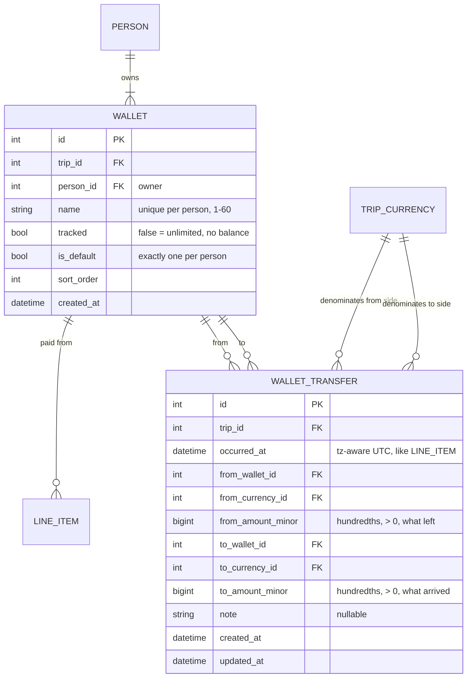

# Trip Accounter — Wallets

> **Status: designed, not yet implemented.** §1–§5 are the design and will be folded
> into `ERD.md`, `API.md` and `DECISIONS.md` as the code lands. §6–§9 are the
> implementation plan and can be deleted once the feature ships.

A wallet is a pot of money a person spends from: the card, an envelope of ISK cash, a
prepaid travel card. Every expense names the wallet it was paid from. Money moves
between wallets as a **transfer**, a new kind of row in the feed. A wallet is either
**tracked** — the app shows what is left in it per currency and flags an overcharge —
or **untracked**, in which case the wallet is nothing more than a fact recorded on the
item.

---

## What this lets you do

Written for whoever is on the trip, not whoever builds the app. Each numbered case
is something you can do once wallets ship; the tests in §9 play these same stories.

**1. Know how much cash you have left.**
Before the trip you add a wallet called *Cash* in Setup and switch it to *tracked*.
At the airport ATM you record a transfer: 20 000 ISK from *Card* to *Cash*. Every
cash purchase you log, you pick *Cash* as the wallet instead of *Card*. The Wallets
tab shows *Cash*: received 20 000, spent 18 400, left 1 600 ISK. When you spend more
cash than you ever put in, the row turns red with a warning — either you forgot to
log a withdrawal, or somebody else's cash paid and it should be on their wallet.

**2. Keep the card out of it.**
Your default wallet is *Card*. It is not tracked: no balance, no warning, no work.
Every expense lands on it unless you say otherwise, so if you never open Setup the
app behaves exactly as before. A wallet only starts asking for attention once you
mark it tracked.

**3. Withdraw abroad.**
The ATM charges your EUR account and hands you ISK. Record one transfer: from *Card*
20 EUR, to *Cash* 2 800 ISK. The app stores both amounts as you typed them and never
invents a rate. *Cash* shows +2 800 ISK; *Card* is untracked so it shows nothing.

**4. Exchange at a kiosk.**
Same thing between two of your own pots, or inside one: from *Cash* 20 EUR, to *Cash*
150 DKK. The Wallets tab now shows *Cash* with two rows, one per currency. Exchange
only works between your own wallets; the app refuses an exchange into somebody else's.

**5. Hand cash to a friend and have it count.**
Ann gives Bob 5 000 ISK because he is paying the guesthouse in cash. Record a transfer
from *Ann · Cash* to *Bob · Cash*. Both wallets move, and the Balances tab now says
Ann is owed 5 000 ISK more and Bob owes 5 000 ISK more — the same as if Ann had paid a
5 000 ISK expense that was entirely Bob's. Settle-up suggestions include it.

**6. Bring cash from home.**
You arrive with 500 EUR in an envelope. Record a transfer from *Card* to *Envelope*
500 EUR on the first day. *Card* is unlimited, so it is the natural source for money
that came from anywhere outside the trip.

**7. Fix a mistake.**
A purchase logged from *Card* was actually cash: open it, change the wallet, save.
A withdrawal you never made: open the transfer, delete it. The Wallets and Balances
tabs recompute on the next visit. If you change who paid, the wallet snaps back to
that person's default; if you pick a wallet the payer does not own, the app tells
you.

**8. Read the feed as a story.**
Transfers sit in the day-by-day list between the expenses, with an arrow icon, both
wallets named and the amount in grey so it does not read as spending. Day totals and
statistics stay expenses only: a withdrawal is not a cost. Untracked *Card*
purchases show nothing extra; a purchase from any other wallet shows the wallet's
name after the payer.

**9. Rename, reorganise, tidy up.**
In Setup you can rename *Card* to *Visa*, add a second card, make a different wallet
the default for someone, or delete a wallet nothing ever used. A wallet with
history cannot be deleted (the app says how many items and transfers hold it), and
neither can a person or a currency that a transfer still touches.

**10. Import an old spreadsheet.**
`tools/import_sheet` keeps working unchanged. Every imported row is paid from the
payer's *Card*; the sheet knows nothing about wallets and does not need to.

**What it deliberately does not do.** No budget or limit on a wallet (a tracked
wallet's balance *is* the limit). No stored exchange rate. No per-wallet statistics
page. No transfer that changes currency between two people.

---

## 1. Decisions

| Topic | Decision | What it beat |
|---|---|---|
| **Transfer storage** | A separate `wallet_transfer` table. `line_item` gains one column, `wallet_id`. | A `kind` column on `line_item`, and joined-table inheritance. Both make every `SUM(amount_minor)` in the codebase wrong until it filters by kind — six stats queries, `day_totals`, `total_spent`, the CSV export and the `share_owed` view — and both force a country and a fake share onto a transfer. Inheritance adds a table-rewriting migration and SQLModel polymorphism on top. A separate table changes the meaning of nothing that exists. |
| **One fetch for the feed** | `GET /items` answers `{items, day_totals, transfers}`. The frontend merges the two sorted lists by `occurred_at`. | A `UNION ALL` timeline from the server. Ordering rows by timestamp is not money arithmetic, so it is allowed client-side; the union is additive later if ever wanted. |
| **Cross-owner transfers** | Allowed. Ann's cash → Bob's cash makes Ann a creditor: `net = paid − owed + sent − received`. | Same-owner only. Handing cash to a friend is the most common real transfer, and this is exactly the additive `SETTLEMENT(from, to, currency, amount)` slot `DECISIONS.md` §2 reserved. **`DECISIONS.md` "Paybacks are not recorded" is amended:** settle-up suggestions are still never marked paid, but a transfer between two people's wallets is recorded and enters `net`. |
| **Default wallet** | The server creates `Card` (untracked, `is_default`) for every person, inside `roster.create_person`. Renameable. | The client supplying it. `curl` and the import tool would then have to know about wallets before they could create an item. `Card` is the one seeded user-visible string in `app/`, alongside the server-assigned `initial` and ISO-code country names; it is recorded as the exception, not a precedent. |
| **Wallet currency** | None. A wallet holds any currency; its balance is per currency, like everything else. | A currency per wallet plus an `initial_amount`. Funding a tracked wallet is a transfer into it from `Card`, which is unlimited; bringing 500 EUR from home is the same transfer. |
| **Currency exchange** | A transfer has two typed sides: what left the sending wallet and what arrived in the receiving one, each with its own currency. `20 EUR → 15 CHF` is one row. **Only between wallets of the same person**; a cross-owner transfer is single-currency. The two wallets may be the same one when the currencies differ (exchanging inside a mixed-currency `Cash`). | A stored rate — a rate is a lie with a timestamp (`DECISIONS.md` §2), and two typed amounts imply it without persisting it. Cross-owner exchange — it would leave `Σ net` per currency non-zero, and making it balance needs the conversion the design forbids. |
| **Migration** | Wallets go into a rewritten `0001_initial.py` that spells out every table with explicit `op.create_table` calls — a frozen schema, no `metadata.create_all`. No `0002`, no backfill. | A guarded `0002` with a data migration. The app is unpublished, so there is no database to migrate; and today's `0001` creates whatever `models.py` currently says, which means every future migration would have to guard against tables that already exist. Freezing it now fixes both. |
| **Where balances show** | A new **Wallets** tab, `/t/{slug}/wallets`, fed by `GET /trips/{slug}/wallets` on first open. | Inside the Balances tab (mixes person nets with pot balances) or Statistics (spend-only). Wallet CRUD stays in Setup, like every roster entity. |

Out of scope, deliberately: a limit or budget on a wallet, a stored or displayed
exchange rate, wallet history views, per-wallet statistics groups.

---

## 2. Data model



`LINE_ITEM` gains `wallet_id FK NOT NULL`, with the invariant
`wallet.person_id = line_item.payer_id`.

Constraints, following the composite-FK pattern every cross-trip reference already
uses (`app/models.py:168-186`):

```
wallet(person_id, name) UNIQUE          wallet(id, trip_id) UNIQUE
wallet(person_id, trip_id) -> person(id, trip_id)
wallet_transfer(from_currency_id, trip_id) -> trip_currency(id, trip_id)
wallet_transfer(to_currency_id, trip_id)   -> trip_currency(id, trip_id)
wallet_transfer(from_wallet_id, trip_id)   -> wallet(id, trip_id)
wallet_transfer(to_wallet_id, trip_id)     -> wallet(id, trip_id)
CHECK (from_wallet_id <> to_wallet_id OR from_currency_id <> to_currency_id)
line_item(wallet_id, trip_id)              -> wallet(id, trip_id)
```

Indexes: `wallet(person_id)`, `wallet_transfer(trip_id, occurred_at)`,
`wallet_transfer(from_wallet_id)`, `wallet_transfer(to_wallet_id)`, `line_item(wallet_id)`.

**Invariants**
- A transfer whose currencies differ is an **exchange** and must stay with one owner:
  `from_currency_id <> to_currency_id ⇒ from_wallet.person_id = to_wallet.person_id`
  (service check, `422 cross_owner_exchange`). A same-currency transfer between the
  same wallet is meaningless (`422 same_wallet`); an exchange inside one wallet is not.
- Every person has exactly one `is_default` wallet. It is the fallback when an item
  write omits `wallet_id`. It cannot be deleted (`409 is_default`); `PATCH
  {"is_default": true}` on a sibling moves the flag first, the same mechanics as
  currency `is_primary`.
- A wallet referenced by an item or a transfer cannot be deleted (`409 in_use`,
  `count` = items + transfers).
- A person whose wallets appear in any transfer cannot be deleted (extends the
  existing payer/share guard). A currency with transfers cannot be deleted.
- Person → wallets cascade. Trip → transfers cascade.

**Money.** All integer hundredths, summed in SQL, `to_wire` once at the edge:

```
per currency c, over cross-owner transfers only (from_wallet.person_id <> to_wallet.person_id):
  sent[p]      = Σ from_amount_minor where from_wallet.person_id = p AND from_currency_id = c
  received[p]  = Σ to_amount_minor   where to_wallet.person_id   = p AND to_currency_id   = c
  net_micro[p] = paid×10⁴ − owed_micro + (sent − received)×10⁴

tracked wallet w, per currency c:
  received = Σ to_amount_minor    where to_wallet_id = w   AND to_currency_id = c
  sent     = Σ from_amount_minor  where from_wallet_id = w AND from_currency_id = c
  spent    = Σ line_item.amount_minor where wallet_id = w AND currency_id = c
  balance  = received − sent − spent                               # < 0 is the overcharge signal
```

`total_spent`, every statistics group, `day_totals` and the CSV export stay sums of
**expenses only**. Transfers are movement, not spending.

A transfer between one person's own wallets — plain or exchange — moves nothing
between people and is **left out of `sent`/`received` altogether**; it shows up only
in the wallet report. Only a cross-owner transfer enters `net`, and by rule it is
single-currency, so it adds equal and opposite hundredths and `Σ net` per currency
stays within floor loss of zero. `suggestions` are unchanged; they consume `net_micro`.

---

## 3. API additions

Shapes come from `app/schemas.py` and `openapi.json`; this is the meaning.

**Roster.** `trip.wallets` is a flat list in owner `sort_order` then wallet
`sort_order`: `{id, person_id, name, tracked, is_default, sort_order}`. CRUD at
`/trips/{slug}/wallets[/{id}]`. `is_default` is not just a form hint here — it is the
server's own fallback.

**Items.** `wallet_id` in and out. Omitted on create → the payer's default wallet.
On `PATCH` with a new `payer_id` and no `wallet_id` → the new payer's default. A
wallet the payer does not own → `422 wallet_owner_mismatch`.

**Transfers.** `/trips/{slug}/transfers[/{id}]`, full CRUD. Write body
`{from_wallet_id, from_amount, from_currency_id, to_wallet_id, to_amount?,
to_currency_id?, occurred_at?, note?}` — `to_amount`/`to_currency_id` default to the
from side, so a plain transfer sends one amount and an exchange sends two. Read
shape has both sides always, plus `from_currency_code`, `to_currency_code`, `id`,
`created_at`, `updated_at`. Both amounts are typed values: 2 places, hundredths in
the database, no rate anywhere. `GET /items` carries the same rows under
`transfers`, sorted `occurred_at DESC, id DESC`, so painting the feed is still one
call. No country, no labels, no split.

**Balances.** `people[]` gains `sent` and `received` (2 places, typed sums of
cross-owner transfers in that currency); `net` follows the formula above. A currency
block is present when it has any item **or any cross-owner transfer**; `total_spent`
is items only.

**Wallets report.** `GET /trips/{slug}/wallets` → `{wallets: [...]}`, each wallet as
in the roster plus `balances: [{currency_code, currency_id, received, sent, spent,
balance}]` — one row per currency with activity, currency `sort_order`; `[]` for an
untracked wallet or a tracked one nothing touched yet. A negative `balance` is the
overcharge; the client says so, the server just reports the sign.

**Export.** CSV header gains `wallet_id` after `payer_id`. Transfers are not
share-grained and stay out of the CSV; the JSON export gains a `transfers` block.

**Validation rows for `API.md` §4**

| Field | Rule | `code` | `params` | reference wording |
|---|---|---|---|---|
| wallet `name` | 1–60 chars, unique per owner | `required` / `too_long` / `duplicate` | `{max}` / `{name}` | "Already a wallet by that name." |
| wallet `person_id` | belongs to this trip | `not_in_trip` | | "Unknown person." |
| item `wallet_id` | belongs to this trip; owned by `payer_id` | `not_in_trip` / `wallet_owner_mismatch` | | "That wallet isn't the payer's." |
| `from_wallet_id`, `to_wallet_id` | required, in trip; same wallet only when the currencies differ | `required` / `not_in_trip` / `same_wallet` | | "Pick two different wallets." |
| `from_amount`, `to_amount` | canonical grammar, `> 0` | `invalid_amount` | | "Enter an amount." |
| `from_currency_id`, `to_currency_id` | in trip; differ only when both wallets have one owner | `not_in_trip` / `cross_owner_exchange` | | "Exchange only between your own wallets." |
| `DELETE` default wallet | refused | `is_default` | | "Make another wallet the default first." |

Four new codes: `wallet_owner_mismatch`, `same_wallet`, `cross_owner_exchange`,
`is_default`. Each needs the row above, a class in `services/errors.py`, an
`err.<code>` key in every catalog, and a backend test that triggers it — all in one
commit, or `make lint` fails.

---

## 4. Frontend

Rules that bind every change: `FRONTEND.md` §4. Call budget stays exact: transfers
ride `GET /items`; the Wallets tab is one call on first open and none after.

| Piece | What it does |
|---|---|
| `store.js` | `items` loader also stores `transfers`; new `wallets` loader for the report. Both reset in `load()`. After any item or transfer write, `state.wallets = state.balances = null` so those tabs refetch on next open — same `if (!store.x) reload(x)` pattern Balances uses. |
| `views/Trip.js` | `TABS` gains `['wallets', 'nav.wallets']` after Balances; dispatch renders `Wallets`. |
| `views/Wallets.js` (new) | One card per person. Per wallet: name, `tracked`/untracked text. Per tracked wallet, one row per `balances[]` entry: received · sent · spent muted, `balance` right-aligned; `text-danger` plus `bi-exclamation-triangle-fill` plus `t('wallets.overcharge')` when `< 0`. Sign decides colour; nothing is summed. |
| `views/Items.js` | Feed entries `{kind:'item'|'transfer', row}`, sorted `occurred_at` desc (items first on a tie, id desc), then the existing `groupByDay`. Filter matches transfers on note or either wallet's name. `day_totals` untouched. Modal opens with `{kind, row}`. |
| `components/ItemRow.js` | The meta line gains `· {walletName}` after the payer when the item's wallet is not the payer's default, so a pot other than `Card` is visible in the feed. |
| `components/DayGroup.js` | Dispatches `ItemRow` or `TransferRow` by kind, `key=${kind}-${id}`. |
| `components/TransferRow.js` (new) | Same shell as `ItemRow` plus class `transfer-row`: owner avatar + wallet name → owner avatar + wallet name; time · note; on the right the from amount muted, and for an exchange `20 EUR → 15 CHF` (both sides shown, no rate computed — rule 1). |
| `components/ItemModal.js` | **Stays one component** (two Bootstrap modals swapping under `.modal.show` flicker and break the modal locators). Header gains an Expense / Transfer switch in new mode; kind is frozen when editing. Expense: after the payer chips a `<select name="wallet_id">` over the payer's wallets, defaulting to `is_default`; choosing another payer resets the select to that payer's default; body gains `wallet_id`. Transfer: renders `TransferFields`, saves to `/transfers`, reloads `items`, never calls `preview-split`. |
| `components/TransferFields.js` (new) | `from_wallet_id` select, from amount + currency input-group; `to_wallet_id` select, to amount + currency input-group. Wallet selects have an `<optgroup>` per active person; `to` starts empty so `reportValidity()` forces a choice. The to side mirrors the from side (amount and currency) until the user edits it, and is visually secondary until it differs. A cross-owner pick with different currencies is not prevented client-side; the server's `cross_owner_exchange` renders under `to_currency_id`. |
| `views/Setup.js` | A **flat `WalletsSection`** after People — nesting wallets inside `PersonRow` breaks `test_setup.py`'s strict locators. Row: owner avatar + name (click to rename), default/tracked text, a `btn-link` Track/Untrack (a button, never an `<input>` in the resting row), Make default, trash hidden on the default wallet, inline `in_use` alert as `PersonRow` does. Add form: owner select, name, tracked switch. |
| `i18n/en.js`, `cs.js` | `nav.wallets`; `setup.wallets`, `setup.wallets_hint`, `setup.wallet_name_placeholder`, `setup.wallet_tracked`, `setup.wallet_untracked`, `setup.make_default`, `action.track`, `action.untrack`; `item.kind.expense`, `item.kind.transfer`, `item.wallet_label`; `transfer.new_title`, `transfer.edit_title`, `transfer.from_label`, `transfer.to_label`, `transfer.note_placeholder`, `transfer.delete_confirm`, `transfer.receives_label`;
`wallets.untracked`, `wallets.flow`, `wallets.overcharge`, `wallets.no_activity`, `wallets.empty`; `err.wallet_owner_mismatch`, `err.same_wallet`, `err.cross_owner_exchange`, `err.is_default`. **`balances.note` is reworded** — it currently promises that nothing is recorded. |

---

## 5. Fixtures and the mock

`tests/frontend/fixtures/trip.json`, every value copied from the seeded backend
(`app/seed.py` is extended to produce exactly this state):

- `trip.wallets`: `Card` for each of the four people; Petr `Cash` (tracked); Ann
  `Envelope` (tracked). Each row also carries `balances` — see the routing note.
- Items: item 42 paid from Petr `Cash`, item 38 (DKK) from Ann `Envelope`, the rest
  from the payer's `Card`.
- `items.transfers`: Petr `Card → Cash` 20 000 ISK on 2026‑09‑14 12:00 (funding,
  lands between two same-day items); Ann `Card → Bob Card` 5 000 ISK on
  2026‑09‑13 18:00 (cross-owner, lands between two days); Petr `Cash 20 EUR → Cash
  150 DKK` on 2026‑09‑13 09:00 (an exchange inside one wallet, the two-currency row
  the transfer tests need). Feed order 42, T2, 41, 40, T1, 39, T3, 38 is what the
  merge test asserts.
- `balances`: `sent`/`received` on every person; ISK nets and suggestion order shift.
  EUR and DKK nets are unchanged — the exchange is Petr's own.
- Wallet report: Petr `Cash` ISK `received 20000, sent 0, spent 18400, balance 1600`,
  EUR `received 0, sent 20, spent 0, balance -20`, DKK `received 150, sent 0, spent 0,
  balance 150`; Ann `Envelope` DKK `received 0, sent 0, spent 480, balance -480` — the
  overcharge. (Petr's `-20 EUR` is also negative: an exchange out of a wallet nothing
  funded. Fine — two red rows exercise the rendering twice.)
- `routes`: items `extra` gains `"transfers": "#/items/transfers"`; a `/transfers`
  collection over the same pointer (`insert: head`, `defaults` supplying
  `from_currency_code`/`to_currency_code` so an echoed row renders); a `/wallets` collection over
  `#/trip/trip/wallets`. One URL serves both the CRUD collection and the report GET,
  and the engine allows one route per URL, so the trip's wallet rows carry `balances`
  in the fixture; Setup and the modal ignore that key (`FRONTEND.md` rule 5). No
  engine change.
- `empty.json`, `hostile.json`: `wallets`, `wallet_id`, `transfers: []`, the routes;
  hostile gets a wallet named `<i>x</i>` and a transfer note with markup.
  `errors/409_is_default.json`.

---

## 6. Backend implementation plan

### Models — `app/models.py`
`Wallet`, `WalletTransfer`; `Person.wallets` (cascade `all, delete-orphan`, ordered);
`Trip.transfers` (cascade); `LineItem.wallet_id` with `fk_item_wallet_trip`; extend
every `overlaps=` string on `LineItem`'s relationships with `wallet`.

### Migration — `alembic/versions/0001_initial.py`, rewritten and frozen
- Today `0001` runs `SQLModel.metadata.create_all(bind)`, so it creates whatever
  `app/models.py` says at the moment it runs. That is not a migration, it is a
  snapshot that moves. The app is unpublished, so `0001` is rewritten in place: one
  explicit `op.create_table(...)` per table — `trip`, `person`, `wallet`,
  `trip_currency`, `trip_country`, `label`, `item_label`, `line_item`,
  `wallet_transfer`, `item_share` — with every column, constraint name and index
  written out, then `op.execute(create_share_owed_view)`. `downgrade` drops the view
  and the tables in reverse order. Wallets are simply part of the schema.
- Constraint and index names must match the models exactly — CI's `alembic check`
  compares the migrated database to `SQLModel.metadata` and fails on any drift, so
  the frozen file cannot silently fall behind. From here on a schema change is a
  real `0002`, and `make migration` autogenerates it against a stable baseline.
- `dev.db` files that exist locally predate the freeze and are simply deleted
  (`make clean`); nothing is backfilled anywhere.

### Services
- `roster.py`: `create_person` also calls `create_default_wallet`; `app/seed.py`
  builds `Person(...)` directly and must call it too, and set `wallet_id` on its items.
  New `create_wallet` / `update_wallet` / `delete_wallet` / `default_wallet`;
  transfer counts in `delete_person` and `delete_currency`.
- `errors.py`: `WalletOwnerMismatchError`, `SameWalletError`,
  `CrossOwnerExchangeError`, `IsDefaultError(ConflictFieldError)`.
- `wallets.py` (new): `wallet_balances(session, trip_id)` — three
  `GROUP BY (wallet_id, currency_id)` queries over the trip: `received` on
  `(to_wallet_id, to_currency_id)`, `sent` on `(from_wallet_id, from_currency_id)`,
  `spent` on `(wallet_id, currency_id)`; tracked wallets only, merged per wallet in
  currency order.
- `balances.py`: `sent`/`received` via two `GROUP BY` queries per currency joining
  both wallets and filtering `sender.person_id <> receiver.person_id`, each on its own
  side's currency column; the skip rule counts a currency as active when any item or
  any cross-owner transfer touches it.
- `export.py`: header column; `transfers` in JSON.
- `tools/import_sheet/writing.py`: `wallet_id = default_wallet(payer).id`. No layout change.

### Schemas — `app/schemas.py`
`WalletCreate`, `WalletUpdate`, `WalletOut`, `WalletBalanceOut`,
`WalletReportOut(WalletOut)`, `WalletEnvelope`, `WalletListEnvelope`;
`TransferWrite`, `TransferOut`, `TransferEnvelope`, `TransferListEnvelope`;
`TripOut.wallets`; `ItemWrite.wallet_id`, `ItemOut.wallet_id`;
`ItemListEnvelope.transfers`; `BalancePersonOut.sent/received`.

### Routers
- `routers/wallets.py` and `routers/transfers.py`, cloned from `routers/countries.py`;
  registered in `app/main.py`.
- `routers/items.py`: `_validate_refs` gains `wallet_id`; create and PATCH apply the
  default-wallet rule; `list_items` adds the transfers query.

### Backend tests (`skills/writing-unit-tests` applies)
- `conftest.py`: `wallets` slice, `default_wallet_of(person_id)`, `transfer_body()`.
- `test_roster.py`: default `Card` on person create; wallet CRUD; `duplicate`;
  `is_default` move and refusal; `in_use` with count; person/currency delete blocked
  by a transfer.
- `test_items.py`: omitted `wallet_id` → default; `not_in_trip`;
  `wallet_owner_mismatch`; PATCH payer re-defaults; round trip.
- `test_transfers.py` (new): CRUD; omitted `to_*` echoes the from side; exchange
  inside one wallet accepted; same wallet same currency → `same_wallet`; different
  currencies across owners → `cross_owner_exchange`; `invalid_amount` on either side;
  cross-trip 404; order in the items envelope; absent from `day_totals`, `stats`,
  `total_spent`.
- `test_balances.py`: net formula with `sent`/`received`; a same-owner transfer and a
  same-owner exchange change no net in any currency; cross-owner shifts two;
  transfer-only currency present.
- `test_wallets.py` (new): the report — arithmetic, negative balance, untracked → `[]`,
  currency order, an exchange debits one currency row and credits another on the
  same wallet.
- `test_import_sheet.py`, `test_export.py`, `test_trips.py` extended.

---

## 7. Frontend implementation plan

Files and behaviour are in §4. Tests:

- `conftest.py`: `TABS` gains `"Wallets"`.
- `test_setup.py`: the parametrized add/rename/delete table gains `Wallets` rows;
  Track sends `PATCH {tracked: true}`; the `refused_delete` glob covers wallets; the
  default wallet shows no Delete.
- `test_item_modal.py`: both whole-body assertions gain `wallet_id`; default and
  reset-on-payer-change; edit preselects; transfer mode posts the exact body to
  `/transfers` and never calls `preview-split`; the to side mirrors the from side
  until edited, and an exchange posts both sides.
- `test_items_view.py`: feed order including `.transfer-row`; the row shows both
  wallets and owners; clicking opens the transfer edit modal; filter by note; the day
  header still equals `day_totals`.
- `test_wallets_view.py` (new): one card per person; the DKK row is `.text-danger`
  with the overcharge text, the ISK row is not; untracked rows; first open one call,
  revisit none.
- `test_balances_view.py`: updated ISK rows and suggestion order.
- `test_unknown_fields.py`: unknown keys on a transfer and a wallet; Wallets in the
  tab loop. `test_call_budget.py`: opening a trip still 3; saving a transfer 2;
  Wallets first open 1. `test_router.py`: `/t/{slug}/wallets` deep link.
  `test_escaping.py`: the hostile wallet name.

---

## 8. Order of work and verification

Each step leaves `make test_backend` green; `make lint` is green from step 6 on (the
four error codes, their catalog keys and their `API.md` rows land together).

1. **Docs**: fold §2–§3 into `ERD.md`, `API.md`, `DECISIONS.md`.
2. **Models + errors + frozen `0001`.** `uv run alembic check` clean — that is the whole migration test; CI runs it.
3. **Roster + wallets CRUD + `TripOut.wallets`**, `seed.py`, import tool. `make openapi`.
4. **Items `wallet_id`**, CSV header.
5. **Transfers** router, items envelope, JSON export.
6. **Balances + wallet report**; `err.*` keys and `balances.note` in both catalogs.
7. **Fixtures** from the seeded server; `make test_tools`.
8. **Store + Setup wallets.**
9. **ItemModal wallet select.**
10. **Transfer form.**
11. **Feed merge, `TransferRow`, `DayGroup`.**
12. **Wallets tab.**
13. **End-to-end scenarios** (§9): the backend stories and the Playwright flows — in
    the existing suites.
14. `FRONTEND.md`, `MOCKAPI.md`, `BACKEND.md` touch-ups (the §6 test table gains the
    two scenario files); delete §6–§9 of this file.

```bash
make lint            # ruff + lock + check_i18n (catalog keys ↔ API.md codes)
make test_backend    # migration-built DB, every computed number
make test_tools      # the mock engine accepts the new routes
make test_frontend   # Playwright against the updated fixtures
make openapi-check   # committed spec matches the schemas
uv run alembic check # metadata == migrated schema, as CI does
```

Manual check: `make clean migrate seed start_dev_server`; add a tracked wallet in
Setup, fund it by transfer, overspend it, open the Wallets tab and see the red row;
export CSV and confirm the `wallet_id` column.

PR title: `feat(wallets): per-person wallets, transfers and a wallets tab`.

---

## 9. End-to-end scenarios

Unit-shaped tests above prove each rule in isolation. These prove the feature as a
holiday uses it: many writes in sequence, then every read that depends on them. They
are not a separate suite or target — just the longest tests in the two existing
directories, run by `make test_backend` and `make test_frontend` like everything else,
and split by the same rule (`ARCHITECTURE.md` §6):

| Where | Runs | Proves | Does not assert |
|---|---|---|---|
| `tests/backend/test_scenarios_wallets.py` | `TestClient`, in-memory DB | every number after a realistic sequence of writes | anything about the screen |
| `tests/frontend/test_flow_wallets.py` | Chromium against the mock | a user can get from Setup through the modal to the feed and the Wallets tab, and the bodies sent are exactly right | that a rendered number is *correct* — the mock computes nothing, so a flow asserts the round trip and the backend story asserts the figure |

Every scenario follows `skills/writing-unit-tests`: state built through the write
path, whole envelopes asserted, expected money written as literals, ordering pinned.
A story is one test function with a docstring naming the holiday it plays out; the
steps are plain sequential requests, not helpers that hide them.

### 9.1 Backend stories

Fixture: the standard `trip` (Petr, Ann, Bob, Eva ½; ISK primary, EUR; Iceland).
`wallets` slice and `default_wallet_of(person_id)` from `conftest.py`.

**Story 1 — a week in Iceland.** Petr adds tracked `Cash`. Funds it: `Card → Cash`
20 000 ISK. Pays the 18 400 ISK dinner from `Cash`, split four ways. Exchanges at the
airport: `Card` 20 EUR → `Cash` 2 800 ISK. Ann hands Bob 5 000 ISK cash (`Ann Card →
Bob Card`). Bob buys 7 900 ISK fuel from his `Card`, split four ways. Assert, all
literal:

- `GET /wallets`: Petr `Cash` has exactly one row, ISK
  `{received: 22800, sent: 0, spent: 18400, balance: 4400}`; every `Card` has
  `balances: []` (untracked, even Petr's which sent 20 EUR).
- `GET /balances` ISK: `sent`/`received` are `5000` on Ann/Bob only; every other
  person `0`; `net` per person equals `paid − owed + sent − received` computed from
  the block's own fields; `|Σ net| < 0.00001`; `Σ suggestions == 0` and replaying
  them zeroes every net (the existing replay pattern). EUR block is **absent** —
  the exchange was Petr's own, and nothing else touched EUR.
- `GET /items`: `transfers` sorted newest first with the exchange showing
  `from_amount 20, from_currency_code "EUR", to_amount 2800, to_currency_code "ISK"`;
  `day_totals` for the dinner's day is `18400 + 7900` ISK only.
- `GET /stats` ISK `total == 26300`; `by_person` unchanged by any transfer.
- `GET /export?format=csv`: header pinned with `wallet_id` in position 7; every
  dinner row's `wallet_id` is Petr's `Cash`. `?format=json` has three `transfers`
  and `trip.wallets` with five entries.

**Story 2 — an envelope overdrawn, then repaired.** Ann adds tracked `Envelope`.
Pays 480 DKK lunch from it before anything went in → `Envelope` DKK
`balance -480`. Funds `Card → Envelope` 500 DKK → `balance 20`. `PATCH` the lunch's
`wallet_id` to her `Card` → `Envelope` DKK `{received 500, sent 0, spent 0,
balance 500}`. `DELETE` the funding transfer → `Envelope` has `balances: []`, the DKK
balances block is absent again, and `GET /transfers/{id}` is `404 not_found
{resource: "transfer"}`.

**Story 3 — the payer changes under an item.** Item paid by Petr from `Cash`. `PATCH
{payer_id: Ann}` with no wallet → `wallet_id` is Ann's `Card`. `PATCH {wallet_id:
Petr's Cash}` while the payer is Ann → `422 {fields: {wallet_id: {code:
"wallet_owner_mismatch"}}}` and the item is unchanged on re-read. `PATCH {payer_id:
Petr, wallet_id: Petr's Cash}` in one body → `200`. Then deactivate Petr: creating a
new item with `payer_id` Petr is still `422 inactive`, but the existing item reads
back with Petr's `Cash`, and `GET /wallets` still lists Petr's wallets.

**Story 4 — roster lifecycle.** Rename Petr's `Card` to `Visa`; `POST` another
wallet named `Visa` → `409 duplicate {name: "Visa"}`. Make `Cash` the default →
`GET /trips/{slug}` shows exactly one `is_default` per person. Now `DELETE` the old
default (`Visa`, unreferenced) → `204`. Create an item from `Cash` and a transfer
into it, then `DELETE Cash` → `409 {fields: {id: {code: "is_default"}}}`; move the
default back to a new wallet, `DELETE Cash` again → `409 in_use {count: 2, name:
"Cash"}` (one item, one transfer). `DELETE` Ann after a handover from her `Card` →
`409 in_use`. `DELETE` the EUR currency after an exchange touched it → `409 in_use`.
`DELETE` the whole trip → `204`; a second trip created before it is untouched
(its `wallets` and `transfers` read back identical).

**Story 5 — exchange rules and the two-sided PATCH.** `Cash → Cash` 100 ISK → `422
same_wallet` on `to_wallet_id`. `Petr Cash 20 EUR → Ann Card 2 800 ISK` → `422
cross_owner_exchange` on `to_currency_id`. `Petr Cash 20 EUR → Petr Cash 2 800 ISK`
→ `201`; the row echoes both sides. `PATCH {from_amount: "30"}` on that exchange →
`to_amount` stays `2800`. `PATCH {from_amount: "25000"}` on a plain ISK transfer →
`to_amount` follows to `25000`. `PATCH {to_currency_id: ISK}` on the exchange with
`to_amount` omitted → it is now a plain transfer and `to_amount` follows
`from_amount`. After all of it, every balances block still satisfies `|Σ net| <
0.00001`, and Petr's `Cash` report lists ISK before EUR (currency `sort_order`, not
insertion order).

**Story 6 — the import tool.** Import `fixtures/sheet.csv` through `apply()` (the
existing pattern in `test_import_sheet.py`), read back over `client`: every item's
`wallet_id` is its payer's `Card`, `GET /wallets` lists two `Card`s with `balances:
[]`, `GET /items` has `transfers: []`.

### 9.2 UI flows (mock API)

The mock echoes writes and serves fixture numbers; a flow asserts **what was sent**
(recorded request bodies), **what came back was rendered**, and **which calls
happened**. Never that a figure is right. Each flow is one test, starting from
`trip.json`, using `stub` only for error envelopes.

**Flow 1 — a new pot, then an expense from it.** Setup → Wallets card → `+ Add` →
owner Petr, name `Cash`, tracked on → save. Assert `POST /wallets {person_id: 1,
name: "Cash", tracked: true}`, one `GET /trips/{slug}` after, and the new row under
Petr with the tracked text. Items → `+` → payer Petr → wallet select now offers
`Card` and `Cash` (Cash is id 1000 from the mock counter) → pick Cash → name, amount →
save. Assert the whole `POST /items` body including `wallet_id: 1000`, then the feed
row's meta line shows `Cash`.

**Flow 2 — funding a wallet by transfer.** Items → `+` → Transfer → from `Petr ·
Card` → to `Petr · Cash` → 20000 ISK → note → save. Assert the exact body
(`to_amount`/`to_currency_id` absent or equal — pin one), no `preview-split` call, two
API calls in total, and a `.transfer-row` rendered between the two same-day items
with both wallet names. Open the Wallets tab → exactly one `GET /wallets` (the write
invalidated it) → tab renders the fixture rows.

**Flow 3 — an exchange.** Transfer → from `Petr · Cash`, 20, currency EUR → edit the
receiving side: 150, DKK → to wallet `Petr · Cash` → save. Assert the body carries
both sides, and the row reads `20 EUR → 150 DKK` (no rate anywhere in the DOM).

**Flow 4 — a handover, and the rule that stops an exchange across owners.** Transfer
→ from `Ann · Card` → to `Bob · Card` → 5000 ISK → save; the row shows both avatars.
Then the same with a DKK receiving side: `stub` the `422 cross_owner_exchange`
envelope on `POST /transfers`; the catalog sentence appears under the receiving
currency select and the modal stays open.

**Flow 5 — editing and deleting a transfer.** Click a fixture transfer row → modal
opens in transfer mode with both sides prefilled and the kind switch hidden → change
the note → save → `PATCH /transfers/{id}` body is exactly `{note: "…"}` plus the
unchanged fields the form always sends (pin the list). Reopen → Delete → confirm →
`DELETE /transfers/{id}` → the row is gone after the `GET /items`.

**Flow 6 — the payer switch resets the wallet.** New expense → payer Petr → wallet
`Cash` → click Ann's chip → select now shows Ann's `Card` and offers only Ann's
wallets → save → body has Ann's default `wallet_id`.

**Flow 7 — overcharge and the guarded delete.** Wallets tab from `trip.json`: Ann's
`Envelope` DKK row has `.text-danger` and the overcharge sentence; Petr's `Cash` ISK
row does not; every `Card` shows the untracked text and no figures. Setup → Wallets →
the default wallet has no Delete button; `stub` `409 is_default` on `DELETE` of a
non-default one → inline alert with the catalog text, row still present.

**Flow 8 — cold deep link and language.** Open `/t/{slug}/wallets` directly → two
calls (`GET /trips/{slug}`, `GET /wallets`), the tab is active, `nav.wallets` text
matches `en.js`. Switch to `cs` → every new key renders Czech (parametrize over the
new `wallets.*`/`transfer.*` keys, the same shape `test_i18n.py` uses).

**Flow 9 — call budget across the whole feature.** One test that opens a trip (3),
saves an expense with a wallet (2), saves a transfer (2), visits Wallets (1), revisits
Items (0), revisits Wallets after nothing changed (0), saves another transfer (2),
revisits Wallets (1). Asserted as equalities on `count_requests`.

Fixture additions these flows rely on: the `/wallets` collection with `defaults`
including `balances: []`, the `/transfers` collection with `insert: head` and currency
code defaults, `errors/422_cross_owner_exchange.json`, `errors/409_is_default.json`,
and a transfer in `hostile.json` whose note carries markup (`test_escaping.py`
parametrization).
